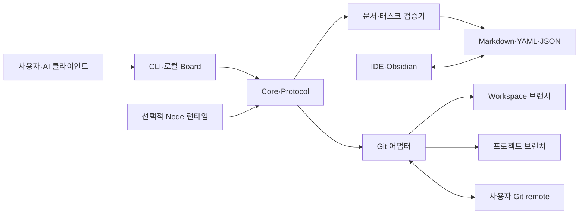

# 런돌 시스템 아키텍처

## 컨텍스트와 경계

런돌은 기존 Git 저장소 안에서 실행되는 로컬 우선 프로젝트 거버넌스 도구다. 사람과 AI 클라이언트는 CLI, 로컬 Board, IDE 또는 Obsidian을 통해 동일한 Markdown·YAML·JSON 정본을 읽고 수정한다. Git은 버전 이력과 원격 협업을 담당하며, 런돌은 저장 구조·메타데이터·책임·링크·태스크 상태를 검증한다.

런돌의 책임은 Workspace와 프로젝트 연결, 표준 문서·태스크 관리, 품질 검증, Git 저장·동기화, 충돌 기록과 로컬 UI 제공이다. 소스 코드 호스팅, Git 인증, 범용 실시간 공동 편집, 조직별 업무 내용 결정은 시스템 경계 밖이다.

신뢰 경계는 로컬 프로세스와 Git remote 사이에 있다. 로컬 파일은 운영체제 사용자 권한을 따르며, 원격 작업은 사용자가 구성한 Git 자격 증명을 사용한다. Board의 HTTP 인터페이스는 localhost에만 바인딩하고 변경 요청을 세션 토큰으로 보호한다.

## 컴포넌트

| 컴포넌트 | 책임 | 소유 데이터 | 의존 대상 | 담당 팀/역할 |
|---|---|---|---|---|
| `@rundol/cli` | `rdl`·`rundol` 명령 파싱, 유스케이스 실행과 결과 출력 | 영구 데이터 없음 | Core, Protocol, Git, 파일 시스템 | Engineering Lead |
| `@rundol/core` | 공통 도메인 계약, Workspace·문서·태스크 규칙과 검증 로직 | 영구 데이터 없음 | Node.js 표준 기능 | Engineering Lead |
| `@rundol/protocol` | 메시지, 동기화와 협업 경계의 계약 | 영구 데이터 없음 | Core | Engineering Lead |
| `@rundol/board` | Workspace 탐색, 문서·태스크 UI와 localhost JSON API | 메모리 index, 세션 토큰 | Core, Protocol, 프로젝트 파일 | Engineering Lead |
| `@rundol/node` | 선택적 협업 Node 실행 환경과 `rundol-node` 명령 | 런타임 상태 | Core, Protocol | Engineering Lead |
| Workspace Registry | 프로젝트·Client 등록과 공유 임대 이벤트의 정본 | `workspace.yaml`, `clients/`, `projects/`, `events/` | `rundol/workspace` 브랜치 | 프로젝트 책임자 |
| 프로젝트 저장소 | 프로젝트 헌장, 정규 문서와 분할 태스크의 정본 | `project.md`, `docs/`, `tasks/` | `rundol/<project-key>` 브랜치 | 프로젝트 책임자 |
| 로컬 런타임 상태 | projection, pending 충돌, 잠금과 진단 로그 | `.rundol/state/`, `.rundol/logs/` | 파일 시스템 | 로컬 실행 주체 |
| Git 어댑터 | ref·commit·worktree·fetch·merge·push 관리 | Git object와 ref | 시스템 Git, 사용자의 remote | Engineering Lead |

## 데이터 흐름

### Workspace 초기화와 연결

1. CLI가 실행 위치의 Git 저장소 루트와 기존 Workspace 존재 여부를 확인한다.
2. `rundol/workspace`에 Workspace Registry를 만들거나 원격 ref를 fetch한다.
3. 프로젝트별 `rundol/<project-key>` ref를 만들거나 가져온다.
4. 각 ref를 `projects/workspace/`와 `projects/<project-key>/` linked worktree로 연결한다.
5. 제품 브랜치에서는 로컬 `.git/info/exclude`로 `projects/*/`를 숨겨 소유권 경계를 유지한다.

### 문서와 태스크 변경

1. CLI·Board·IDE가 프로젝트 worktree의 Markdown 또는 JSON을 수정한다.
2. Board 변경은 조회 시 받은 revision을 `baseRevision`으로 제출하며 불일치하면 `409 Conflict`를 반환한다.
3. Core 검증기가 frontmatter, 프로젝트 책임 구조, 문서 링크, 태스크 상태와 완료 조건을 검사한다.
4. 검증 성공 시 프로젝트 ref에 커밋하고, 실패 시 저장을 중단하거나 Board 편집의 원본을 복원한다.
5. Board의 Watch index는 정본에서 메모리 snapshot과 로컬 projection을 다시 계산한다.

### 원격 동기화

1. Workspace Registry를 먼저 저장하고 원격과 동기화한다.
2. 선택 프로젝트의 로컬 변경을 엄격 검증한 후 커밋한다.
3. 원격 ref를 fetch해 fast-forward하거나 공통 base 기반 3-way 병합을 수행한다.
4. 병합 결과 전체를 다시 검증한다.
5. 충돌이 없을 때만 push하며 강제 push는 사용하지 않는다.
6. 해결하지 못한 충돌은 `.rundol/state/pending/`에 기록하고 사용자의 명시적 해결을 기다린다.

태스크는 `tasks/<client-id>/<segment>.json`으로 분할하며 segment당 기본 500건을 저장한다. 서로 다른 Client의 생성 작업은 다른 샤드를 수정하고, 동일 태스크의 동시 변경은 Git 병합 충돌로 드러난다. `.rundol/state/tasks.json`은 삭제 후 재생성 가능한 호환 projection일 뿐 정본이 아니다.

## 실행과 배포

| 영역 | 설계 |
|---|---|
| 런타임 | Node.js 14 이상과 시스템 Git 2.20 이상에서 실행되는 CommonJS CLI·로컬 HTTP 프로세스다. |
| 네트워크 | 핵심 로컬 기능은 네트워크 없이 동작한다. Board는 `127.0.0.1`에만 바인딩하며, fetch·push와 설치에만 외부 연결을 사용한다. |
| 저장소 | Markdown·YAML·JSON 일반 파일과 Git commit/ref가 정본이다. 제품, Workspace, 프로젝트 데이터는 별도 브랜치가 소유한다. |
| 배포 단위 | npm workspaces가 `@rundol/core`, `@rundol/protocol`, `@rundol/cli`, `@rundol/node`, `@rundol/board`, 통합 `rundol` 패키지를 동일 버전으로 배포한다. |
| 관측 | CLI의 구조화 JSON 출력과 `.rundol/logs/debug.jsonl`, `.rundol/logs/sync.jsonl`, Board의 Git·Needs Attention 상태를 사용한다. |
| 복구 | Git ref·commit에서 정본을 복구하고 `rdl git init`, `rdl refresh`, `rdl attach`로 worktree와 projection을 재생성한다. 기존 ref를 자동 삭제하거나 강제 push하지 않는다. |

## 품질 속성

| 속성 | 목표 | 설계 대응 | 검증 방법 |
|---|---|---|---|
| 이식성 | 전용 애플리케이션 없이 자료를 읽고 백업할 수 있다. | 일반 파일과 표준 Git을 정본으로 사용한다. | 새 환경에서 clone·attach 후 문서와 태스크를 직접 열어 확인한다. |
| 무결성 | 메타데이터, 책임, 링크와 상태 누락을 저장 전에 발견한다. | 공통 Core 검증과 `rdl check --strict` 품질 게이트를 적용한다. | fixture 및 실제 프로젝트의 strict 검사 결과가 오류 0건인지 확인한다. |
| 격리성 | 제품 브랜치가 런돌 운영 자료를 소유하지 않는다. | 전용 orphan branch, linked worktree와 로컬 exclude를 사용한다. | 초기화 전후 제품 브랜치의 추적 파일 목록을 비교한다. |
| 오프라인 가용성 | 핵심 생성·편집·검증·조회가 외부 서비스 없이 동작한다. | 로컬 Node.js 프로세스, 파일 시스템과 Git object만 사용한다. | 네트워크 차단 환경에서 핵심 CLI와 Board 시나리오를 실행한다. |
| 충돌 안전성 | 원격 변경을 묵시적으로 덮어쓰지 않는다. | base revision, 비강제 push, 3-way 병합과 pending 충돌 기록을 사용한다. | 동시 편집과 divergent branch 통합 테스트를 수행한다. |
| 확장성 | 대량 태스크에서 단일 파일 충돌과 전체 재작성을 줄인다. | Client별·segment별 태스크 샤드와 메모리 index를 사용한다. | 1만 건 규모 fixture의 생성·조회·병합·검사 시간을 측정한다. |
| 설치 신뢰성 | 통합·개별 패키지 설치가 같은 명령 계약을 제공한다. | 동일 버전 workspace와 tarball 기반 설치 검사를 사용한다. | `npm run version:check`, `npm run test:install`, `npm run release:check`를 실행한다. |
| 호환성 | 지원 OS와 기존 schema에서 데이터를 잃지 않고 진화한다. | 경로 정규화, 명시적 migration과 이전 ref 보존 정책을 적용한다. | Windows·macOS·Linux 및 schema migration fixture를 검증한다. |

## 보안과 개인정보

- CLI와 파일 접근 권한은 운영체제 사용자 및 저장소 권한을 따른다.
- Git remote 인증은 시스템 Git credential helper 또는 사용자가 구성한 SSH·HTTPS 자격 증명에 위임하며 자격 증명을 프로젝트 파일에 저장하지 않는다.
- Board는 localhost에만 바인딩하고 변경 API에 실행 시 생성되는 `X-Rundol-Token`을 요구한다. 조회 revision과 쓰기 base revision을 비교해 오래된 편집의 덮어쓰기를 막는다.
- Client ID는 작업 출처 식별자이며 인증 수단이 아니다. 실제 원격 쓰기 권한은 Git 자격 증명으로 제한한다.
- 문서 임대는 충돌 가능성을 낮추는 소프트 임대이며 보안 잠금으로 간주하지 않는다.
- Markdown 렌더링은 신뢰할 수 없는 HTML과 다이어그램 입력을 정화·제한해야 하며 브라우저에서 임의 스크립트를 실행하지 않는다.
- 프로젝트 문서에는 개인정보가 포함될 수 있으므로 보존, 삭제, 원격 복제와 접근 정책은 해당 Git 저장소 관리자가 결정한다. 로그에는 토큰·자격 증명·문서 원문 같은 비밀을 남기지 않는다.

## 알려진 제약

- Git을 사용할 수 없거나 linked worktree를 지원하지 않는 환경에서는 핵심 저장 모델을 사용할 수 없다. 지원 Git 최소 버전 변경 시 재검토한다.
- 소프트 임대와 파일 단위 병합은 문자 단위 실시간 공동 편집을 제공하지 않는다. 다수 사용자의 동시 편집 빈도가 운영상 허용 범위를 넘으면 별도 협업 계층을 검토한다.
- 원격 인증·DNS·TLS·프록시 문제는 런돌이 해결하지 않으며 진단 정보와 안전한 중단만 제공한다.
- Board의 localhost 세션 토큰은 로컬 악성 프로세스로부터의 강한 격리를 보장하지 않는다. 다중 사용자 호스트나 원격 노출 요구가 생기면 인증·권한 모델을 별도로 설계한다.
- 프로젝트 문서의 의미적 정확성과 조직별 승인 여부는 자동 검증만으로 보장할 수 없다. 책임자와 검토자의 명시적 검토가 필요하다.
- 패키지는 동일 버전으로 릴리스되므로 독립 버전 전략보다 배포 결합도가 높다. 패키지별 변경 주기와 호환성 비용이 크게 달라질 때 재검토한다.

## 아키텍처 결정 요약

| 결정 | 선택 | 근거 | 상세 기록 필요 조건 |
|---|---|---|---|
| 정본 저장소 | 일반 파일과 Git | 이식성, 오프라인 사용, 도구 중립성과 복구 가능성을 확보한다. | 별도 데이터베이스 도입을 검토할 때 ADR 작성 |
| 브랜치 소유권 | 제품·Workspace·프로젝트 분리 | 제품 코드와 거버넌스 자료의 수명 주기 및 권한 경계를 분리한다. | 브랜치 모델 또는 ref 규칙 변경 시 ADR 작성 |
| 태스크 저장 | Client·segment 기반 샤드 | 대형 단일 파일의 충돌과 쓰기 증폭을 줄인다. | segment 정책이나 저장 형식 변경 시 ADR 작성 |
| 동기화 | 비강제 Git fetch·merge·push | 공통 이력을 보존하고 원격 변경 유실을 방지한다. | 중앙 조정 서비스 또는 새 병합 전략 도입 시 ADR 작성 |
| 사용자 인터페이스 | CLI 중심, localhost Board 보조 | 자동화 가능성과 사람이 읽기 쉬운 로컬 경험을 함께 제공한다. | 원격 Board 또는 다중 사용자 서버 제공 시 ADR 작성 |
