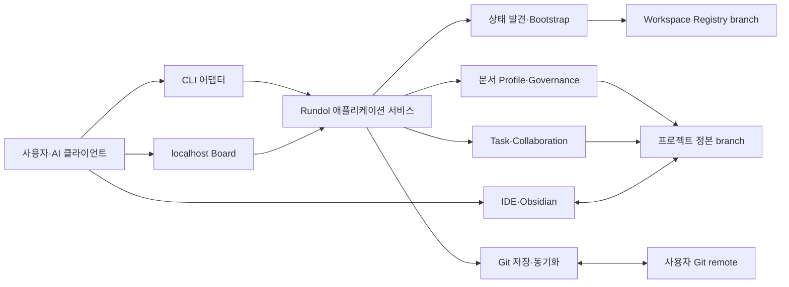

# 런돌 시스템 아키텍처

## 컨텍스트와 경계

Rundol은 기존 Git 저장소에 연결되는 로컬 우선 프로젝트 운영 도구다. 프로젝트 헌장, 요구사항, 설계, 태스크와 운영 증거를 사용자가 소유하는 Markdown·YAML·JSON과 Git commit으로 보존한다. CLI, localhost Board, IDE, Obsidian과 AI 클라이언트는 서로 다른 데이터베이스를 만들지 않고 같은 프로젝트 정본을 읽고 변경한다.

Rundol은 다음을 책임진다.

- 로컬·원격 Rundol 상태 발견과 Workspace·프로젝트 부트스트랩
- 프로젝트별 문서 정책, canonical 경로와 거버넌스 검증
- 태스크·완료 조건·Client·문서 임대의 정본 관리
- 검증된 저장, 원격 동기화, 충돌 보존과 복구
- 로컬 Board와 AI 클라이언트가 사용하는 결정적 인터페이스

Git hosting, 자격 증명 발급, 제품 source branch 작업, 문서 내용의 사실 승인, 범용 실시간 공동 편집과 중앙 Rundol 서비스는 경계 밖이다.



신뢰 경계는 로컬 프로세스와 사용자 Git remote 사이, localhost HTTP 호출자와 Board 변경 API 사이에 있다. 파일 접근 권한은 운영체제 사용자에게, 원격 권한은 시스템 Git 자격 증명에 위임한다.

## 설계 원칙

1. 정본과 파생 상태를 구분한다. 정본은 일반 파일과 Git이고 index, snapshot, pending cache와 로그는 재생성 가능한 로컬 상태다.
2. 발견을 쓰기보다 먼저 수행한다. 원격 상태를 판정할 수 없으면 신규 seed를 만들지 않는다.
3. 프로젝트별 데이터와 정책은 해당 `rundol/<project-key>` branch가 소유한다.
4. Workspace branch는 프로젝트·Client Registry와 공유 sequence·lease event만 소유한다.
5. AI의 의미 판단과 CLI의 결정적 변경을 분리한다. 인터뷰·본문 작성은 스킬, ID·경로·ref·검증은 CLI가 담당한다.
6. 검증 실패와 충돌은 기존 정본을 덮어쓰지 않고 명시적인 복구 상태로 남긴다.
7. 기능 컴포넌트와 npm 배포 패키지의 경계를 동일한 것으로 가정하지 않는다.

## 논리 컴포넌트

| 컴포넌트 | 책임 | 입력 | 출력·소유 상태 |
|---|---|---|---|
| CLI 어댑터 | 인수 parsing, 대화형·비대화형 모드 선택, 사람용·JSON 결과 출력 | argv, cwd, stdin/TTY | 영구 상태 없음 |
| Bootstrap Orchestrator | 발견 결과를 생성·연결·복구·선택·충돌 action으로 라우팅 | 저장소 경로, remote, project, 신규 의도 | bootstrap action과 후보·진단 |
| Rundol Discovery | 로컬 manifest/ref/worktree와 원격 Workspace·프로젝트 ref를 부작용 없이 조사 | Git 저장소와 remote | 정규화된 discovery snapshot |
| Workspace Registry Gateway | Workspace schema, 프로젝트·Client 등록과 공유 sequence·lease event 관리 | `rundol/workspace` | `workspace.yaml`, `projects/`, `clients/`, `events/` |
| Project Lifecycle | 독립 project ref와 linked worktree 생성·연결·분리·복구 | discovery snapshot, project registry | `rundol/<key>`, `projects/<key>/` |
| Document Profile Evaluator | profile·trait·override를 유형별 정책으로 결정하고 검증 | guided 답변 또는 비대화형 설정 | `project.md`의 `documentProfile` |
| Document Service | ID 예약, canonical 경로 생성, legacy 진단·migration | 문서 유형·owner·related, project policy | `docs/**/*.md`, migration plan |
| Governance Validator | project, 문서, 링크, 정책과 태스크 계약 검사 | 프로젝트 정본 파일 | 구조화 diagnostics와 summary |
| Task Service | shard 기반 태스크 생성·상태·완료 조건과 projection 관리 | task 명령·Board 요청 | `tasks/<client-id>/*.json`, 로컬 projection |
| Collaboration Service | Client Registry와 만료 가능한 문서 soft lease | Client·lease 명령 | Workspace client·event 정본 |
| Git State Service | 검증된 commit, fetch·merge·push와 pending 충돌 | 프로젝트·Workspace 정본 | Git ref·commit, `.rundol/state/pending/` |
| Board Server | 조회 snapshot과 revision 기반 변경 API, 정적 UI 제공 | localhost HTTP | 메모리 snapshot·session token |
| Rundol Governance Skill | 프로젝트 인터뷰, 문서 의미 작성과 관련 컨텍스트 선택 | 사용자 맥락과 project policy | 제안·본문 변경, CLI 실행 요청 |

현재 저장소의 핵심 애플리케이션 구현은 루트 `src/`와 `bin/rdl.js`에 있고 `@rundol/cli` 빌드가 이를 `dist/`로 복사한다. `@rundol/core`와 `@rundol/protocol`은 공유 상수·프로토콜 계약을 제공하며, 위 논리 컴포넌트를 모두 직접 소유한다고 가정하지 않는다.

## 데이터 소유 경계

```text
제품 branch
└─ 제품 source와 일반 repository 파일

rundol/workspace
├─ workspace.yaml
├─ projects/project-<key>.yaml
├─ clients/*.yaml
└─ events/**/*.jsonl

rundol/<project-key>
├─ project.md                 # charter + documentProfile
├─ docs/<canonical-type>/*.md
└─ tasks/<client-id>/*.json

로컬 비정본
├─ projects/<key>/.rundol/state/
├─ projects/<key>/.rundol/logs/
└─ projects/<key>/.obsidian/
```

제품 branch는 Rundol 운영 자료를 소유하지 않는다. `projects/*/` worktree 숨김은 `.git/info/exclude`의 로컬 규칙으로 처리한다. `.obsidian`은 개인 Vault 설정이며 원격 프로젝트 정본에 포함하지 않는다.

## 주요 흐름

### 부트스트랩

1. CLI가 Git root, TTY 여부와 명시 옵션을 Bootstrap Orchestrator에 전달한다.
2. Discovery가 로컬 manifest·ref·worktree와 선택 remote의 Workspace·project ref를 읽기 전용으로 조사한다.
3. Orchestrator가 `already-connected`, `repaired`, `attached`, `needs-selection`, `created`, `conflict` 중 하나를 결정한다.
4. 연결·복구라면 기존 commit을 사용해 필요한 worktree만 구성한다.
5. 신규 상태이고 의도가 명확할 때만 Workspace·project seed를 독립 이력으로 생성한다.
6. attach와 discovery 중에는 push하지 않는다.

### 문서 프로파일 구성

1. guided 모드에서는 Governance Skill이 프로젝트 특성을 질문하고 profile·trait를 추천한다.
2. 비대화형 모드는 profile·trait·override를 직접 입력받고 stdin을 기다리지 않는다.
3. Document Profile Evaluator가 모든 정규 유형을 정확히 하나의 정책 상태로 정규화한다.
4. CLI가 `project.md` frontmatter에 schema version과 최종 정책을 저장한다.
5. 시스템은 required·recommended 누락과 다음 생성 명령을 반환하되 빈 문서를 일괄 생성하지 않는다.

### 문서 생성과 구조 이전

1. Document Service가 프로젝트 전체 문서와 Workspace sequence를 확인해 ID를 예약한다.
2. owner·related와 profile policy를 검증하고 유형별 canonical 경로에 초안을 만든다.
3. legacy 문서는 계속 조회하지만 신규 생성 경로로 사용하지 않는다.
4. migration은 dry-run에서 이동·링크 변경·충돌을 계산한 후 명시적 apply에서만 파일을 변경한다.
5. 전체 strict 검사가 실패하면 이전 byte와 경로를 복원한다.

### 저장과 동기화

1. IDE·Board·CLI가 같은 project worktree를 변경한다.
2. Board 쓰기는 session token과 base revision을 검증한다.
3. Governance Validator가 프로젝트 전체의 메타데이터·정책·링크·태스크 상태를 검사한다.
4. 검증된 변경만 project ref에 commit한다.
5. sync는 Workspace를 먼저 동기화하고 project ref를 fetch·fast-forward 또는 3-way merge한다.
6. 병합 결과를 다시 검증한 뒤에만 push한다. 해결되지 않은 충돌은 pending 상태로 보존한다.

## 실행과 배포

| 영역 | 계약 |
|---|---|
| 런타임 | 지원 Node.js와 시스템 Git에서 실행되는 CommonJS CLI와 선택적 localhost HTTP 프로세스 |
| 오프라인 | 로컬 정본 조회·편집·검사·Board는 remote 없이 동작하고 원격 발견·동기화와 설치에만 네트워크 사용 |
| 패키지 | `@rundol/core`, `@rundol/protocol`, `@rundol/cli`, `@rundol/node`, `@rundol/board`, 통합 `rundol`을 동일 버전으로 배포 |
| Board | 기본 `127.0.0.1`, 변경 API token과 base revision, 외부 공개 서버는 비목표 |
| 관측 | 구조화 JSON, diagnostics, `.rundol/logs/*.jsonl`과 Board attention 상태 |
| 복구 | Git ref·commit을 정본으로 사용하고 init·refresh·attach·migration rollback으로 파생 상태 재생성 |

## 품질 속성

| 속성 | 설계 대응 | 핵심 검증 |
|---|---|---|
| 데이터 안전성 | discovery-first, 비강제 push, 원자적 파일 쓰기, migration rollback | 실패 주입 전후 ref·hash 비교 |
| 멱등성 | 정규화 discovery snapshot과 action state machine | 동일 init 반복 시 정본 무변경 |
| 결정성 | versioned profile schema, canonical path map, JSON action 계약 | 같은 입력의 다중 OS 결과 비교 |
| 추적성 | 실제 파일명 Wiki link와 REQ·TST 연결 | strict graph 검사 |
| 단순성 | profile 기반 선택과 작업별 관련 문서 routing | 대표 작업이 2~5개 문서로 시작하는지 확인 |
| 이식성 | Markdown·YAML·JSON과 시스템 Git | 새 환경 clone·init·strict E2E |
| 오프라인 가용성 | 로컬 파일·Git object 기반 핵심 기능 | 네트워크 차단 시나리오 |
| 충돌 안전성 | base revision, 3-way merge, pending conflict | 동시 편집·분기 fixture |
| 성능 | shard task store와 증분 snapshot, bounded 검사 | 대규모 fixture benchmark |

## 보안과 개인정보

- 원격 인증은 시스템 Git credential helper 또는 사용자 SSH·HTTPS 설정에 위임하고 비밀을 문서·로그·JSON 결과에 기록하지 않는다.
- 원격 존재 여부를 판정할 수 없는 인증·DNS·TLS 오류에서는 신규 로컬 ref를 만들지 않는다.
- Board는 localhost에만 바인딩하고 변경 API에 `X-Rundol-Token`과 최신 base revision을 요구한다.
- Client ID와 soft lease는 출처·편집 의도 정보이며 인증·권한 수단이 아니다.
- Markdown과 Mermaid 렌더링은 신뢰할 수 없는 HTML·script 실행을 허용하지 않는다.
- guided 인터뷰에는 비밀정보 입력을 요구하지 않으며 최종 profile·trait만 프로젝트 정본에 저장한다.
- 프로젝트 문서의 개인정보 보존·원격 복제·접근 정책은 Git 저장소 관리자가 결정한다.

## 알려진 제약

- Git 또는 linked worktree를 사용할 수 없는 환경에서는 핵심 저장 모델을 지원할 수 없다.
- `project.md` frontmatter에 중첩 policy schema를 추가하려면 현재의 단순 정규식 기반 parser를 구조화된 parser로 확장해야 한다.
- legacy와 canonical 문서 위치를 함께 읽는 기간에는 조회 경로와 신규 생성 경로가 다르므로 중복 ID 검사가 필수다.
- profile은 문서 필요성을 추천하고 검증할 뿐 문서 내용의 사실성이나 조직 승인을 대신하지 않는다.
- soft lease와 Git 병합은 문자 단위 실시간 공동 편집을 제공하지 않는다.
- localhost token은 같은 사용자 권한의 악성 로컬 프로세스에 대한 강한 격리를 제공하지 않는다.
- 현재 npm package 경계와 논리 애플리케이션 컴포넌트가 일치하지 않으므로 패키지 분리를 전제로 구현하지 않는다.

## 아키텍처 결정 요약

| 결정 | 선택 | 근거 | 기록 |
|---|---|---|---|
| 정본 저장 | 일반 파일과 Git | 이식성·오프라인·복구 | [[ADR-001-Git-기반-분리-브랜치-저장-모델|ADR-001]] |
| branch 소유권 | 제품·Workspace·프로젝트 분리 | 수명주기와 변경 경계 분리 | [[ADR-001-Git-기반-분리-브랜치-저장-모델|ADR-001]] |
| 기본 초기화 | discovery-first `rdl init` | 기존 정본 보호와 단일 진입점 | [[ADR-002-프로젝트-부트스트랩과-문서-프로파일-계약|ADR-002]] |
| 문서 정책 정본 | `project.md` frontmatter | 프로젝트 branch와 원자적 소유 | [[ADR-002-프로젝트-부트스트랩과-문서-프로파일-계약|ADR-002]] |
| 문서 경로 | 유형별 canonical 폴더 | 예측 가능한 생성·이전 | [[ADR-002-프로젝트-부트스트랩과-문서-프로파일-계약|ADR-002]] |
| 동기화 | 비강제 fetch·merge·push | 원격 변경 유실 방지 | [[ADR-001-Git-기반-분리-브랜치-저장-모델|ADR-001]] |
| 사용자 인터페이스 | CLI 중심, localhost Board 보조 | 자동화와 로컬 탐색 결합 | [[PRD-001-Rundol-제품-요구사항|PRD-001]] |
