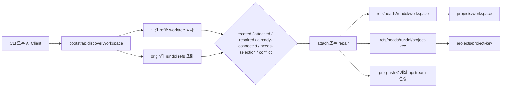
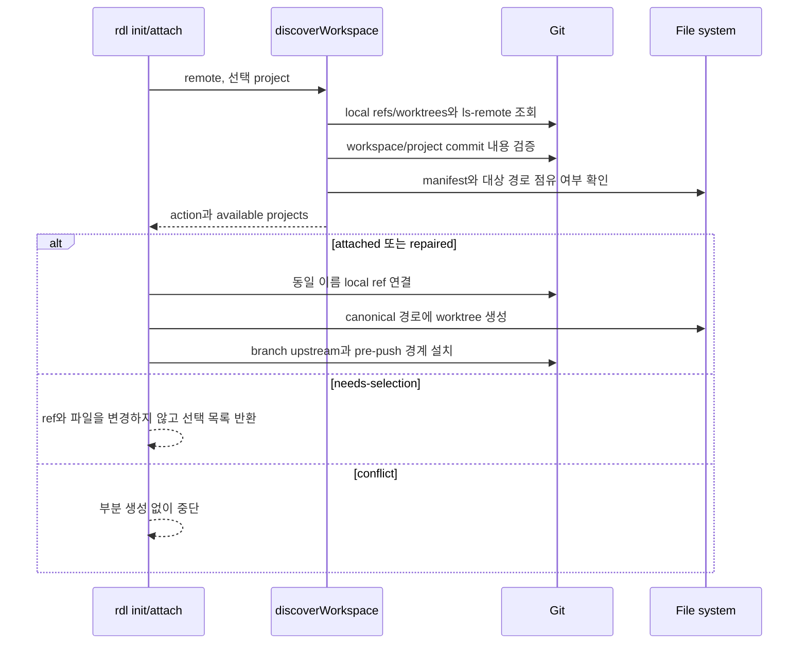
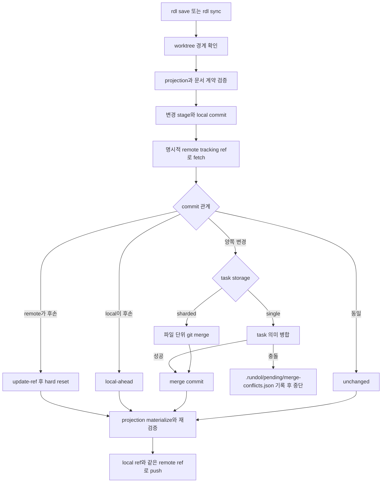

# 깃 작업공간과 동기화 아키텍처

## 컨텍스트와 경계

저장소 루트는 제품 코드 브랜치를, `projects/workspace/`는 `rundol/workspace`를, `projects/<project-key>/`는 `rundol/<project-key>`를 checkout한 linked worktree를 소유한다. `projects/workspace/projects/project-<key>.yaml`이 프로젝트 ref와 mount를 등록하고 각 프로젝트의 `project.md`가 정본 문서 계약을 소유한다. 제품 브랜치에는 프로젝트 산출물을 복제하지 않는다.

## 컴포넌트

| 컴포넌트 | 책임 | 소유 데이터 | 의존 대상 |
|---|---|---|---|
| `src/bootstrap.js` | 로컬·원격 ref, manifest, worktree 관계를 읽고 쓰기 없는 연결 결정을 산출 | discovery 결과 | Git object/ref 조회 |
| `src/attach.js` | 발견된 commit을 동일 이름 로컬 ref에 연결하고 정해진 경로에 worktree를 생성·복구 | worktree, `.git/info/exclude` | bootstrap, branch-boundary |
| `src/workspace.js` | schemaVersion 6 manifest와 project registry를 해석하고 안전한 상대 경로를 강제 | Workspace layout | 파일 시스템 |
| `src/state.js` | 프로젝트 변경 검증, commit, fetch, 병합, materialize, 동일 ref push | 프로젝트 branch와 task store | Git, checker, merge |
| `src/settings.js` | `rundol/workspace` 변경을 저장하고 프로젝트보다 먼저 동기화 | Workspace branch | Git |
| `src/branch-boundary.js` | worktree 역할 검증, `push.default=simple`, managed pre-push hook | Git local config와 hook | Git |

## 발견과 연결 데이터 흐름

`discoverWorkspace`는 원격 탐색 중 필요한 commit object를 fetch할 수 있으나 로컬 branch ref나 worktree를 만들지 않는다. 다중 프로젝트인데 선택이 없으면 `needs-selection`, manifest와 ref 불일치·잘못된 worktree branch·Workspace 분기·비어 있지 않은 대상 경로는 `conflict`다. `attachWorkspace`는 대상 전체의 비점유를 먼저 확인한 뒤 Workspace와 선택 프로젝트를 연결한다.

## 저장과 동기화 데이터 흐름

`syncState`는 Workspace 설정을 먼저 동기화한 뒤 선택 프로젝트를 처리한다. 동시 fetch가 공유 `FETCH_HEAD`를 바꿀 수 있으므로 `refs/remotes/<remote>/<branch>`를 명시적으로 사용한다. 공통 이력이 없거나 의미 충돌이 있으면 자동 병합하지 않는다. push refspec은 항상 `<config.ref>:<config.ref>`이다.

## 실행과 배포

| 영역 | 설계 |
|---|---|
| 런타임 | Node.js CommonJS와 시스템 Git 명령을 사용한다. |
| 네트워크 | 발견·동기화 때 선택 remote만 접근하며 문서 조회와 검증은 로컬에서 수행한다. |
| 저장소 | 정본은 세 개 역할의 Git ref이고 `.rundol/state`, pending, logs는 로컬 실행 상태다. |
| 관측 | discovery action, boundary violations, sync action, commit, push 여부를 JSON 결과로 노출한다. |
| 복구 | 손실된 worktree는 유효한 로컬 ref에서 재생성하고, 분기나 점유 경로는 자동 덮어쓰지 않는다. |

## 품질 속성

| 속성 | 목표 | 설계 대응 | 검증 |
|---|---|---|---|
| 무손실 발견 | 탐색만으로 ref·worktree를 변경하지 않음 | discovery와 attach 분리 | bootstrap/attach 테스트 |
| 역할 격리 | 경로마다 정확히 한 branch 역할 | canonical path와 branch assertion | branch-boundary 테스트 |
| 동기화 결정성 | 동일 commit 관계에서 같은 action | 명시적 tracking ref와 merge-base | git 테스트 |
| 충돌 보존 | 자동 해결 불가 변경을 덮어쓰지 않음 | pending conflict 기록 후 실패 | semantic merge 테스트 |
| push 안전성 | 교차 ref와 기본 삭제 차단 | managed pre-push hook | push validation 테스트 |

## 보안과 운영 제약

Git credential은 시스템 credential helper에 맡기며 Rundol 파일에 저장하지 않는다. 기존 pre-push hook은 `pre-push.rundol-user`로 보존한 후 managed hook이 먼저 실행한다. branch 삭제는 `RUNDOL_ALLOW_DELETE=1`인 명시적 운영 상황만 허용하며 정상 동기화 경로에는 사용하지 않는다.

## 알려진 제약

- Workspace branch가 서로 분기된 경우 자동 의미 병합 대상이 아니며 운영자가 이력을 정리해야 한다.
- `repair`는 유효한 로컬 ref가 있을 때 worktree만 복구하며 손상된 정본 내용을 재구성하지 않는다.
- single task store 의미 병합과 sharded Git 병합은 충돌 표현이 다르므로 운영자는 반환된 action과 pending 파일을 함께 확인해야 한다.
