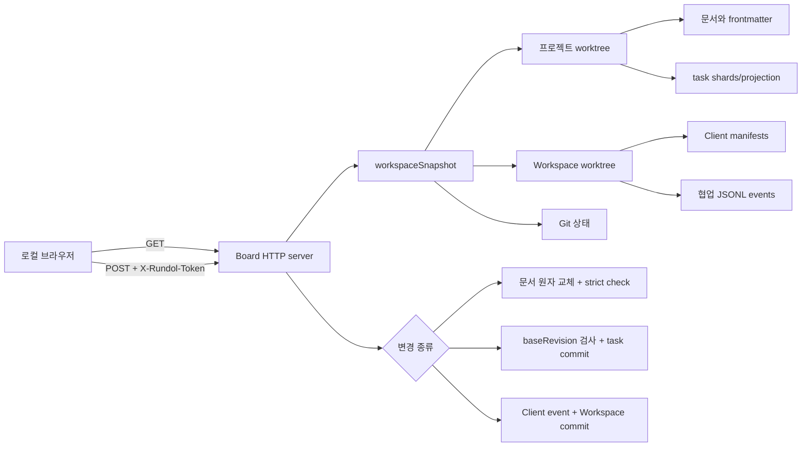
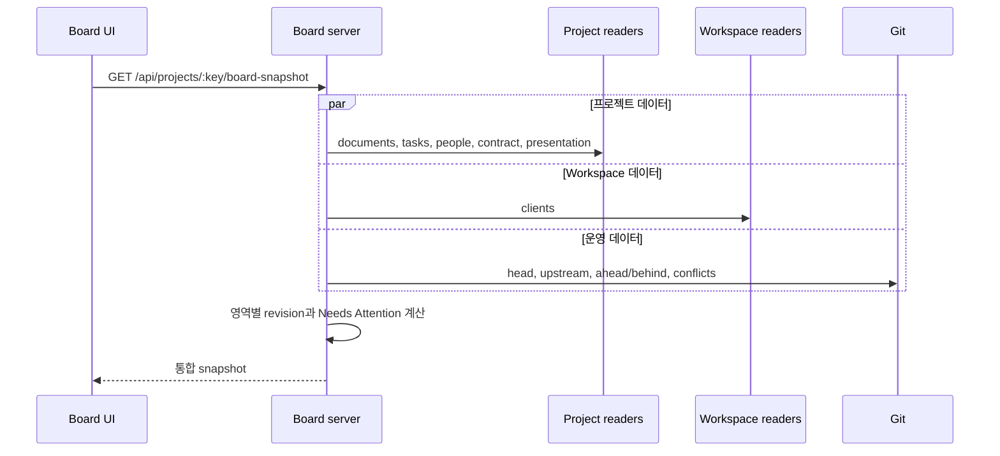
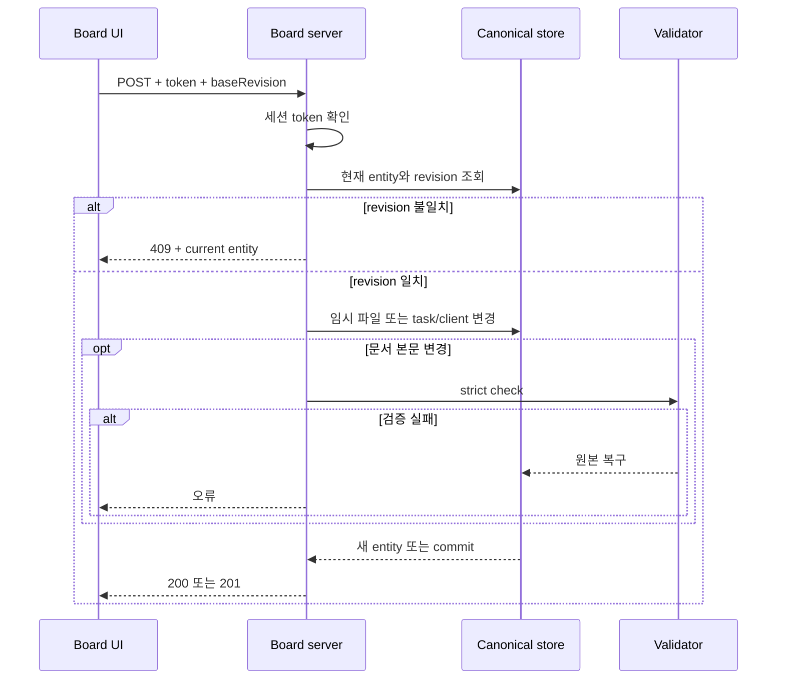

# 로컬 보드와 협업 아키텍처

## 컨텍스트와 경계

Board는 `127.0.0.1`에만 bind되는 단일 Node.js 프로세스다. 별도 데이터베이스를 두지 않고 프로젝트 worktree와 Workspace worktree를 읽어 응답 시점의 snapshot을 계산한다. 변경 API는 실행 때 생성한 세션 token을 요구하며, 문서와 태스크 변경은 조회된 entity revision을 비교해 stale write를 거절한다.

문서 동시 편집을 조정하던 5분 소프트 리스는 [[ADR-015-문서-소프트-리스-폐기와-동시성-판정의-일원화|ADR-015]]로 폐기했다. 중앙 서버가 없으면 만료 시각에 기대는 배타를 보장할 수 없고, 보장하지 못하는 것을 보장하는 것처럼 다루면 복잡도만 남는다. 지금 문서 동시 편집의 판정자는 Git 병합이며, 문서 하나가 파일 하나라 충돌 면적은 이미 작다. 태스크는 원격 ref 갱신의 성패로 판정하는 push 경합을 그대로 쓴다.

## 컴포넌트

| 컴포넌트 | 책임 | 정본 또는 파생 데이터 |
|---|---|---|
| `src/board.js` | route, token 검사, 입력 한도, snapshot 조합, mutation orchestration | 없음 |
| `src/board-data.js` | 문서 목록·본문·SHA-256 revision과 Git sync 상태 계산 | 파생 조회 모델 |
| `src/collaboration-store.js` | Client manifest 검증·저장과 협업 이벤트 append | Workspace branch의 `clients/`, `events/` |
| `src/state.js` | Board의 task refresh·update·sync를 프로젝트 branch에 반영 | task store와 commit |
| `src/document-contract.js` | contract 조회·계획·revision 기반 갱신 | 프로젝트 `project.md` |
| `src/board-ui/*` | snapshot 표시, 편집 중 baseRevision 유지, 사용자 상호작용 | 브라우저 임시 상태 |

## 조회 데이터 흐름

snapshot revision은 하나의 전역 잠금 값이 아니라 `workspace`, `tasks`, `documents`, `people`, `clients`, `sync`, `contract`, `presentation` 영역별 digest다. 문서 개별 revision은 frontmatter와 body를 함께 해시하고 태스크 개별 revision은 태스크 객체를 해시한다.

## 변경 데이터 흐름

문서 본문은 512KB 이하이고 기존 frontmatter를 그대로 보존한다. 임시 파일을 rename한 뒤 strict 검사에 실패하면 원본을 복구한다. 요청 JSON은 64KB로 제한된다. Client 변경은 schemaVersion 6 Workspace에서만 가능하고 변경 후 Workspace branch에 commit된다.

## 동시성 계층

| 계층 | 보호 대상 | 실패 방식 |
|---|---|---|
| loopback bind | 외부 네트워크 노출 | 외부 인터페이스에서 접속 불가 |
| 세션 token | 비조회 mutation | `403` |
| entity revision | 문서·태스크·contract stale write | `409`와 최신 entity |
| Git merge | 동일 문서의 동시 편집 | 서로 다른 문서는 충돌하지 않고, 같은 줄 충돌만 사람이 병합 |
| Git merge/check | 저장소 수준 경합과 계약 위반 | mutation 또는 sync 실패, 원본·충돌 정보 보존 |

## 실행과 관측

| 영역 | 설계 |
|---|---|
| 프로세스 | `startBoard`가 임의 port 또는 지정 port로 `127.0.0.1` listener를 시작한다. |
| 정적 자산 | same-origin으로 제공하고 CSP, `nosniff`, frame 차단을 적용한다. |
| 캐시 | JSON과 앱 자산은 `no-store`, vendored dependency 자산은 하루 캐시한다. |
| 운영 상태 | snapshot의 sync state와 attention 목록으로 dirty, behind, ahead, conflict를 표시한다. |
| 복구 | 문서 검증 실패는 원본 복구, stale write는 최신 entity 재조회, 병합 충돌은 사람이 해소한다. |

## 알려진 제약

- token은 브라우저 HTML에 주입되는 로컬 세션 비밀이며 사용자 계정 인증 수단이 아니다.
- 문서 편집에 프로세스 간 강제 잠금은 없다. 중앙 권위가 없으면 만료 기반 배타를 보장할 수 없으므로 revision 비교와 Git 병합을 판정자로 쓴다.
- snapshot은 요청 시 파일과 Git을 순차 조회하므로 대규모 Vault에서는 응답 비용이 증가한다.
- Board는 중앙 협업 서버가 아니며 원격 다중 사용자 편집이 필요하면 별도 인증·저장 계층 ADR이 필요하다.
