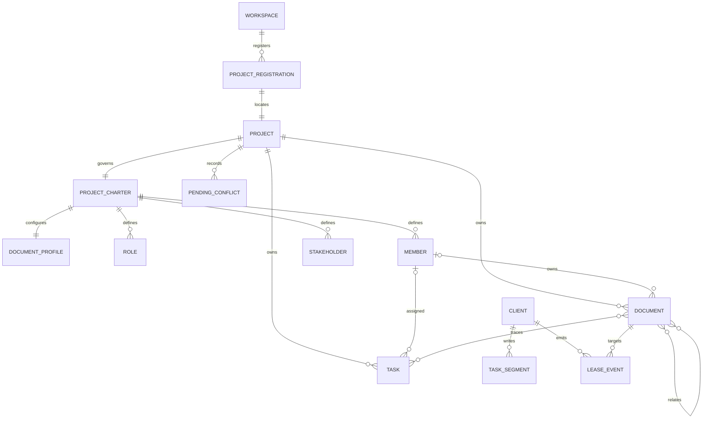

# 런돌 핵심 데이터 모델

## 모델 경계

Rundol의 정본은 데이터베이스가 아니라 Workspace와 프로젝트 전용 Git branch가 소유하는 YAML, Markdown과 JSON 파일이다. Git commit은 변경 이력과 동기화 기준이다. discovery snapshot, bootstrap action, Board snapshot, migration plan과 `.rundol/state/` projection은 정본에서 다시 계산하거나 한 번의 작업에만 사용하는 파생 값이다.



## 정본 엔티티

| 엔티티 | 핵심 필드 | 정본 위치 | 의미 |
|---|---|---|---|
| Workspace | `schemaVersion`, `id`, `mount`, Workspace ref, 경로 계약 | `rundol/workspace:workspace.yaml` | 하나의 제품 Git 저장소에 연결된 Rundol 최상위 Registry다. |
| Project Registration | `schemaVersion`, `revision`, `key`, `name`, `mount`, `ref`, task storage | `rundol/workspace:projects/project-<key>.yaml` | 프로젝트 발견과 worktree 연결에 필요한 최소 등록 정보다. 문서 정책은 소유하지 않는다. |
| Project Charter | canonical metadata, 미션·목표·범위·역할·사람·RACI·위험·협업·완료 정의 | `rundol/<key>:project.md` | 사람과 의사결정 체계, 프로젝트 문서 정책의 고정 진입점이다. |
| Document Profile | `schemaVersion`, `name`, `traits`, `policy` | `project.md` frontmatter의 `documentProfile` | 프로젝트별 문서 필요성과 검증 강도를 표현하는 embedded value object다. |
| Document | canonical metadata와 Markdown body | `rundol/<key>:docs/<type>/*.md` | 제품·요구·설계·결정·검증·운영 정보항목의 정본이다. |
| Task | ID, 상태, 책임, link, dependency, acceptance와 timestamps | `rundol/<key>:tasks/<client-id>/<segment>.json` | 검증 가능한 완료 조건을 가진 작업 정본이다. |
| Task Segment | client ID, segment 번호와 task 집합 | project task shard | Client별 쓰기를 분리하고 segment당 기본 500건을 저장한다. |
| Role | `ROLE-*`, 미션, 결정권, 산출물, escalation | `project.md` block | 책임의 기능적 경계이며 인증 주체가 아니다. |
| Member | `MEMBER-*`, 역할, 소속, 계정, 책임 영역, 상태 | `project.md` block | document·task owner와 reviewer가 참조하는 작업 주체다. |
| Stakeholder | `STAKEHOLDER-*`, 유형, 관심, 영향력, 참여 방식, 담당 역할 | `project.md` block | 승인·보고·자문 관계를 표현한다. |
| Client | ID, 이름, 유형, owner, status와 timestamps | Workspace client manifest | device·agent·service 작업 출처이며 인증 수단이 아니다. |
| Lease Event | action, project, document, client, lease ID와 시간 | Workspace `events/` JSONL | 문서 편집 의도를 나타내는 만료 가능한 soft lease event다. |
| Sequence Event | project, document type, number, document ID, client와 시간 | Workspace `events/sequences/` JSONL | 다중 Client가 충돌 없이 문서 번호를 예약하기 위한 append-only event다. |

## 파생 엔티티

| 엔티티 | 필드 | 수명 | 생성 근거 |
|---|---|---|---|
| Discovery Snapshot | root, remotes, local Workspace/ref/worktree, remote Workspace/projects, diagnostics | 단일 bootstrap 실행 | 로컬 파일·Git ref와 명시적 remote fetch 결과 |
| Bootstrap Action | `action`, root, remote, Workspace, project, candidates, diagnostics | CLI 결과 | Discovery Snapshot을 상태 규칙으로 정규화 |
| Document Index | ID, kind, state, owner, path, links | process 또는 검사 실행 | project의 모든 Markdown frontmatter와 실제 경로 |
| Task Projection | 통합 task map과 generated marker | 로컬 cache | 모든 canonical task shard |
| Active Lease | lease ID, project, document, client, expiresAt | 조회 시점 | Lease Event folding과 현재 시간 |
| Pending Conflict | base·ours·theirs, 대상 필드와 발견 시각 | 명시적 해결까지 | 자동 merge가 해결하지 못한 차이 |
| Migration Plan | source, target, link rewrites, conflicts, source hashes | dry-run부터 apply 종료까지 | legacy document index와 canonical path map |
| Revision | 불투명 content token | entity 내용이 바뀔 때까지 | canonical entity bytes 또는 정규화 결과 |
| Board Snapshot | 영역별 revision, documents, tasks, people, clients, leases, sync, attention | memory/poll cycle | 정본 index와 Git 상태 |

## Document Profile schema

```yaml
documentProfile:
  schemaVersion: 1
  name: service
  traits:
    - api
    - data
    - operations
  policy:
    required:
      - PRD
      - REQ
      - API
      - RUN
    recommended:
      - ARC
      - MOD
      - TST
    onDemand:
      - SCR
      - ADR
      - GLS
    disabled: []
```

### 필드 계약

| 필드 | 타입 | 제약 |
|---|---|---|
| `schemaVersion` | positive integer | 지원 버전이어야 하며 migration 없이 낮추지 않는다. |
| `name` | enum | `lean`, `product`, `service`, `platform`, `assured` 또는 향후 등록된 versioned profile이다. |
| `traits` | unique string array | 알려진 특성만 사용하고 결정적으로 정렬한다. |
| `policy.required` | document type array | 누락 시 strict 오류가 되는 유형이다. |
| `policy.recommended` | document type array | 누락 시 근거 있는 경고가 되는 유형이다. |
| `policy.onDemand` | document type array | 생성 조건이 발생할 때만 사용하는 유형이다. |
| `policy.disabled` | document type array | 현재 범위에서 신규 생성을 하지 않는 유형이다. |

정규 유형 집합은 `PRD`, `REQ`, `ARC`, `SCR`, `MOD`, `API`, `ADR`, `TST`, `RUN`, `GLS`다. 모든 유형은 정확히 한 policy 배열에 있어야 한다. `project.md`와 `NTE`는 이 집합에 포함하지 않는다.

## 관계와 소유권

| 출발 | 관계 | 대상 | 카디널리티 | 수명주기 의미 |
|---|---|---|---|---|
| Workspace | 등록한다 | Project | 1:N | registration 제거 전 project ref와 보존 정책을 결정한다. |
| Project | 소유한다 | Project Charter | 1:1 | project key와 charter ID가 일치해야 한다. |
| Project Charter | 내장한다 | Document Profile | 1:1 configured, 0:1 legacy | profile 변경은 charter와 같은 commit에서 추적한다. |
| Project | 소유한다 | Document | 1:N | 삭제 전 related·task link 무결성을 확인한다. |
| Document Profile | 분류한다 | Document Type | 1:10 | 각 유형은 정확히 하나의 policy state를 가진다. |
| Project Charter | 정의한다 | Role·Member·Stakeholder | 1:N | 참조 중인 주체는 삭제보다 inactive 전환을 우선한다. |
| Member | 책임진다 | Document·Task | 0:N | active owner가 없으면 유효한 정본으로 저장할 수 없다. |
| Document | 관련된다 | Document | N:M | 실제 파일명과 선택 heading·block이 존재해야 한다. |
| Task | 추적한다 | Document | N:M | 동일 project의 artifact ID 또는 section을 사용한다. |
| Task | 의존한다 | Task | N:M | 자기 의존과 순환 의존을 금지한다. |
| Client | 기록한다 | Task Segment·Event | 1:N | 비활성화 후에도 과거 작업 출처를 보존한다. |
| Document | 대상이다 | Active Lease | 1:0..1 | 동시에 하나의 유효 lease만 존재한다. |
| Project | 보유한다 | Pending Conflict | 1:N | 해결과 검증 전 삭제하지 않는다. |

## 불변식

### Workspace와 bootstrap

- Workspace ref는 현재 schema에서 `refs/heads/rundol/workspace`다.
- project key, registration 파일명, mount `projects/<key>`와 ref `refs/heads/rundol/<key>`는 일치한다.
- 제품, Workspace와 각 project 정본은 서로 다른 branch가 소유한다.
- Discovery Snapshot을 완성하기 전에는 manifest, ref, worktree와 exclude를 변경하지 않는다.
- 원격 존재 여부를 판정하지 못한 상태는 `new`가 아니며 신규 seed를 만들 수 없다.
- 하나의 Discovery Snapshot은 정확히 하나의 Bootstrap Action을 만든다.
- `needs-selection`과 `conflict` action은 정본 파일을 변경하지 않는다.
- `already-connected` 반복 실행은 ref, commit과 worktree bytes를 변경하지 않는다.
- attach와 discovery는 remote에 push하지 않는다.

### 문서와 정책

- Project Charter는 프로젝트에 정확히 하나이며 `project:<key>` ID를 가진다.
- documentProfile의 정규 유형 합집합은 전체 유형 집합과 같고 배열 간 교집합은 비어 있어야 한다.
- profile과 traits가 같으면 운영체제·파일 열거 순서와 무관하게 같은 기본 policy를 만든다.
- profile 변경은 기존 문서를 자동 삭제하거나 이동하지 않는다.
- required 유형이 없으면 policy-complete 상태가 아니며 strict 오류다.
- 모든 신규 정규 문서는 유형별 canonical 경로에 생성한다.
- legacy 경로의 문서는 조회 대상이지만 신규 경로 선택의 근거가 아니다.
- 문서 ID, alias와 canonical filename은 project 안에서 고유해야 한다.
- 동일 ID가 두 경로에 있으면 자동 병합하거나 하나를 정본으로 선택하지 않는다.
- document owner는 active Member이고 related·본문 link는 실제 artifact·heading·block을 가리킨다.
- 하나의 사실은 하나의 정본 문서가 소유하고 다른 문서는 link로 참조한다.

### 태스크·협업·동기화

- task ID는 project 안에서 고유하고 하나의 canonical shard에만 존재한다.
- task status는 `todo`, `doing`, `waiting`, `review`, `done`, priority는 `high`, `mid`, `low` 중 하나다.
- done task는 모든 acceptance criterion이 완료되고 필요한 TST 증거와 dependency 완료를 만족해야 한다.
- revision이 최신 값과 다르면 문서·task 변경을 저장하지 않는다.
- lease는 만료 시 효력을 잃으며 만료 event가 새 획득을 막지 않는다.
- projection·index·snapshot을 삭제해도 canonical file과 Git 이력에서 재생성할 수 있다.
- sync는 strict 검증을 통과한 결과만 push하고 force push를 사용하지 않는다.

## 상태 전이

### Bootstrap Action

```text
undiscovered
  └─ discover
      ├─ local-complete       → already-connected
      ├─ local-repairable     → repaired
      ├─ remote-single        → attached
      ├─ remote-multiple      → needs-selection → attached
      ├─ absent + new-intent  → created
      └─ divergent/invalid    → conflict
```

`needs-selection`에서 project 선택 없이 `created`로 전이할 수 없다. `conflict`는 사용자가 원인을 해결한 뒤 새 discovery를 수행해야 한다.

### Document Policy

```text
legacy-unconfigured → configured
configured → reconfigured
```

reconfigure는 문서 자체의 lifecycle state를 변경하지 않는다. disabled 유형의 기존 문서도 별도 검토·삭제 결정 전까지 보존한다.

### Migration Plan

```text
planned → applied → validated
   └──────── failure ────────→ rolled-back
```

validated 전에는 migration 완료로 간주하지 않는다. rollback 후 source path와 bytes는 planned 시점의 hash와 같아야 한다.

## 인덱스와 조회

| 조회 | 접근 전략 |
|---|---|
| bootstrap 상태 | local manifest/ref/worktree와 선택 remote ref를 독립적으로 수집한 뒤 snapshot 정규화 |
| 프로젝트 목록 | Workspace registration을 key로 결정적 정렬 |
| profile과 policy | `project.md` frontmatter를 schema validation 후 읽기 |
| 문서 목록 | project 전체 Markdown을 재귀 탐색해 ID·kind·state·owner·physical path index 생성 |
| required·recommended 누락 | 정규 유형 index와 policy 집합의 차집합 계산 |
| canonical 경로 이탈 | document kind의 path map과 실제 relative path 비교 |
| 관련 작업 문서 | project, 관련 PRD·REQ와 task 관점에 해당하는 document link graph 조회 |
| task 목록 | 모든 shard를 읽어 status·priority·owner·reviewer index 생성 |
| active lease | Workspace event를 시간순 folding하고 `expiresAt > now` 적용 |
| sync 상태 | HEAD, remote ref, merge-base, ahead·behind와 worktree dirty를 요청 시 계산 |

## 저장과 트랜잭션 경계

- project.md의 profile 변경과 프로젝트 문서 변경은 project branch가 소유한다. Workspace Registry에 policy를 복제하지 않는다.
- Workspace sequence 예약은 다른 Client와 ID 충돌을 피하기 위해 Workspace ref와 별도 commit·push가 필요할 수 있다. 문서 파일 생성 실패 시 예약 ID는 재사용하지 않는다.
- 문서 생성은 ID 예약 후 canonical 경로에 원자적으로 쓰고, owner·related와 전체 strict 검사를 통과해야 한다.
- Board 문서 변경은 임시 쓰기, base revision 확인, strict 검사 순으로 수행하고 실패하면 원본 bytes를 복원한다.
- migration apply는 project worktree 안의 파일 이동과 link rewrite를 하나의 검증 단위로 취급한다. 실패하면 source hash 기준으로 전체를 rollback한다.
- Workspace sync와 project sync는 순서가 있는 독립 Git 작업이며 전체 저장소가 하나의 데이터베이스 transaction처럼 원자적으로 rollback되지는 않는다.

## 보존과 개인정보

| 데이터 | 보존 | 삭제·변경 원칙 |
|---|---|---|
| Project Charter·Document Profile | 프로젝트 수명과 Git 감사 정책 기간 | 보정 commit으로 변경하며 과거 정책은 Git 이력에서 추적 |
| 문서·태스크 | 프로젝트 및 법적 보존 기간 | link 영향 검토 후 commit으로 삭제, remote 이력 처리는 저장소 정책 적용 |
| Client·Sequence·Lease Event | 충돌 방지와 감사에 필요한 기간 | client 비활성화 후에도 과거 출처·예약을 보존 |
| Pending Conflict | 해결과 검증 완료까지 | 해결 commit과 증거 확인 후 정리 |
| Discovery Snapshot·Migration Plan | 실행과 진단에 필요한 최소 기간 | 비밀을 제거한 결과만 로그에 남기고 정본으로 승격하지 않음 |
| 로컬 로그 | 장애 분석 최소 기간 | credential, token, guided 자유 입력과 문서 원문을 기록하지 않음 |

guided 인터뷰는 제품 특성만 수집하고 비밀정보를 요구하지 않는다. project.md에는 최종 profile·traits·policy만 저장하며 자연어 답변 전문을 불필요하게 보존하지 않는다.

## 마이그레이션

1. 기존 Workspace·project schema, source ref·commit과 파일 hash를 기록한다.
2. 현재 strict 오류와 중복 ID를 migration 전 진단해 이동 문제와 구분한다.
3. documentProfile이 없는 기존 프로젝트는 문서를 유지한 채 `legacy-unconfigured`로 읽는다.
4. profile 설정은 기존 문서 index를 참고해 추천안을 만들 수 있지만 문서를 자동 삭제·재분류하지 않는다.
5. canonical path migration은 dry-run에서 source·target·link rewrite와 충돌을 모두 계산한다.
6. apply는 파일 이동과 실제 파일명 link 갱신을 수행하고 전체 strict·structure 검사를 실행한다.
7. 검증 실패 시 source path와 bytes를 복원하고 실패한 target을 남기지 않는다.
8. migration은 재실행해도 이미 canonical인 문서를 다시 이동하거나 새 ID를 만들지 않는다.
9. 원본 ref를 자동 삭제하거나 force push하지 않는다.
10. 하위 호환 제거 전 CHANGELOG, CLI 안내와 지원 종료 version을 제공한다.

## 알려진 제약

- 현재 project.md parser와 검사기는 중첩 documentProfile YAML을 완전하게 처리하지 않는다.
- 현재 `rdl doc create`는 PRD·ARC·GLS를 `docs/` root에 생성하므로 canonical path map과 일치하지 않는다.
- 현재 structure audit는 canonical 경로 이탈과 legacy document migration 계획을 제공하지 않는다.
- 문서 번호 예약은 Workspace remote 동기화에 의존할 수 있어 오프라인 신규 ID와 다중 Client 충돌 회피 사이의 정책을 별도로 검증해야 한다.
- Board JSON request 한계와 허용 문서 본문 크기가 다르므로 큰 문서의 편집 계약이 일치하지 않는다.
- soft lease는 로컬 악성 process나 직접 Git 편집을 막는 권한 모델이 아니다.
- Git 이력에 들어간 개인정보의 완전 삭제는 일반 migration과 다른 승인·이력 재작성 절차가 필요하다.
