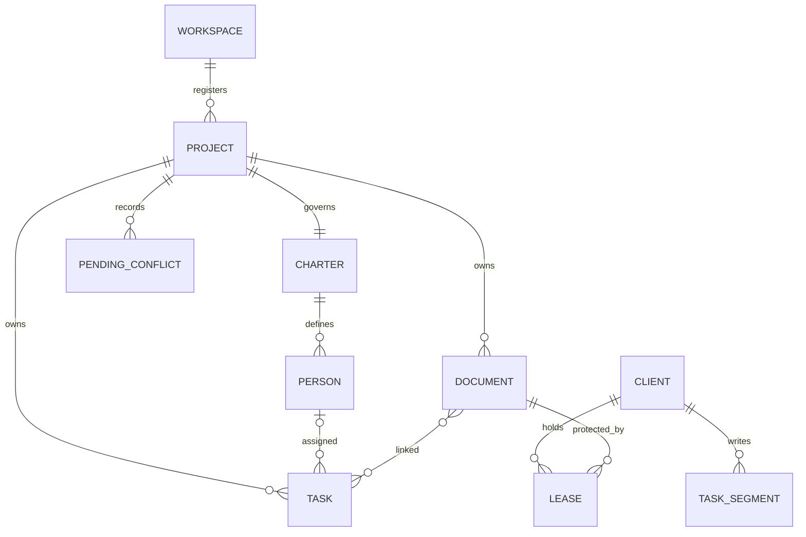

# 런돌 핵심 데이터 모델

## 모델 경계

런돌의 정본은 별도 데이터베이스가 아니라 Workspace 및 프로젝트 전용 Git 브랜치가 소유하는 YAML, Markdown과 JSON 파일이다. 메모리 index, Board snapshot과 `.rundol/state/`의 projection은 정본에서 다시 만들 수 있는 파생 데이터다. Git commit은 변경 이력과 동기화 기준이며 entity revision은 낙관적 동시성 제어를 위한 불투명한 내용 식별자다.

## 엔티티

| 엔티티 | 핵심 필드 | 타입 | 필수 | 정본 위치 | 의미와 제약 |
|---|---|---|---|---|---|
| Workspace | `schemaVersion`, `mount`, Git ref | YAML | 예 | `projects/workspace/workspace.yaml` | 하나의 제품 저장소에 연결된 거버넌스 최상위 경계다. ref는 `refs/heads/rundol/workspace`다. |
| Project Registration | `key`, `name`, `mount`, `ref`, task storage | YAML | 예 | `projects/workspace/projects/project-<key>.yaml` | key는 소문자 영숫자와 단일 하이픈 조합이며 `workspace`는 예약어다. mount와 ref는 key에서 결정된다. |
| Project Charter | 역할·Member·Stakeholder block | Markdown | 예 | `projects/<key>/project.md` | 프로젝트 책임 구조와 협업 주체의 정본이다. block ID는 프로젝트 안에서 고유해야 한다. |
| Document | `id`, `kind`, `title`, `description`, `owner`, `state`, `tags`, `related`, body | Markdown | 예 | `projects/<key>/docs/**` | frontmatter와 한글 중심 파일명 규칙을 만족하고 owner·related가 유효한 대상을 참조해야 한다. |
| Task | `id`, `title`, `status`, `priority`, `owner`, `reviewers`, `links`, `deps`, `acceptanceCriteria`, timestamps | JSON | 예 | `projects/<key>/tasks/<client-id>/<segment>.json` | 상태와 우선순위는 허용 enum만 사용한다. 완료 조건이 없거나 미완료면 done 전이를 허용하지 않는다. |
| Task Segment | client ID, segment 번호, task 배열 | JSON | 예 | task shard 파일 | client별 쓰기를 분리하며 segment당 기본 500건을 담는다. projection과 혼동하지 않는다. |
| Role | `ROLE-*`, name, description | Markdown block | 선택 | Project Charter | 책임의 이름과 범위를 정의하며 인증 주체가 아니다. |
| Member | `MEMBER-*`, name, 역할, 소속, 업무 계정, 책임 영역, 상태 | Markdown block | owner 사용 시 예 | Project Charter | task·document의 책임자 또는 reviewer로 참조할 수 있다. |
| Stakeholder | `STAKEHOLDER-*`, name, 유형, 관심, 영향력, 참여 방식, 담당 역할 | Markdown block | 선택 | Project Charter | 승인·보고 대상이며 task stakeholder로 연결할 수 있다. |
| Client | `id`, `name`, `type`, `owner`, `status`, timestamps | JSON 또는 Workspace event | 등록 시 예 | Workspace Registry | device·agent·service 작업 출처를 식별한다. 인증 수단은 아니다. |
| Lease | project key, document ID, client ID, acquired·expires time | Workspace event | 획득 시 예 | Workspace Registry event | 하나의 문서에 대한 만료 가능한 소프트 임대다. 보안 잠금이나 영구 소유권이 아니다. |
| Pending Conflict | project, ours·theirs commit, 대상·필드, 발견 시각 | JSON | 충돌 시 예 | `.rundol/state/pending/` | 자동 해결하지 못한 동기화 충돌의 복구 근거다. 명시적 해결 전 보존한다. |
| Revision | entity content에서 계산된 token | string | 변경 API에서 예 | 파생 값 | 알고리즘·길이에 의존하지 않는 opaque token이며 base revision 비교에 사용한다. |
| Board Snapshot | 영역별 revision, documents, tasks, people, clients, leases, sync, attention | JSON | 조회 시 예 | 메모리 파생 | 한 번의 저장소 읽기로 만든 UI projection이다. 영구 정본이 아니다. |

## 관계

| 출발 | 관계 | 대상 | 카디널리티 | 삭제와 수명주기 의미 |
|---|---|---|---|---|
| Workspace | 등록한다 | Project | 1:N | 등록 제거 전 project branch와 worktree의 보존·이관 방식을 결정한다. |
| Project | 소유한다 | Document | 1:N | 문서 삭제는 related와 task link 무결성 확인 후 Git 이력으로 추적한다. |
| Project | 소유한다 | Task | 1:N | project 종료 시에도 shard와 commit 이력을 보존한다. |
| Project Charter | 정의한다 | Role·Member·Stakeholder | 1:N | 참조 중인 협업 주체는 즉시 삭제하지 않고 비활성 상태로 전환한다. |
| Member | 책임진다 | Document·Task | 0:N | owner 해제 시 유효한 대체 owner 또는 미지정 허용 규칙이 필요하다. |
| Task | 연결한다 | Document | N:M | link는 동일 project의 유효 문서 ID를 참조한다. |
| Task | 의존한다 | Task | N:M | 자기 의존과 순환 의존을 금지하며 대상 task가 먼저 존재해야 한다. |
| Client | 생성한다 | Task Segment | 1:N | client 비활성화 후에도 과거 shard와 task를 유지한다. |
| Client | 보유한다 | Lease | 1:N | client 비활성화 또는 만료 시 유효 임대에서 제외한다. |
| Document | 보호된다 | Lease | 1:0..1 유효 | 동일 project·document에는 동시에 하나의 유효 임대만 존재한다. |
| Project | 기록한다 | Pending Conflict | 1:N | 해결된 기록만 검증 후 정리하며 원인 확인 전 삭제하지 않는다. |

## 불변식

- Workspace schema version은 지원되는 양의 정수이며 migration 없이 임의로 낮추지 않는다.
- project key, registration 파일명, mount `projects/<key>`와 ref `refs/heads/rundol/<key>`는 서로 일치한다.
- 제품, Workspace와 각 project 정본은 서로 다른 branch가 소유한다.
- 모든 문서 ID와 파일명은 project 안에서 고유하며 문서 유형, 번호와 frontmatter ID가 일치한다.
- 문서 owner는 Project Charter의 활성 Member이며 모든 내부 related link는 실제 artifact를 가리킨다.
- task ID는 project 안에서 고유하며 하나의 canonical shard에만 존재한다.
- task status는 `todo`, `doing`, `waiting`, `review`, `done`, priority는 `high`, `mid`, `low` 중 하나다.
- task가 done이면 모든 acceptance criterion이 완료되어야 하며 미완료 dependency가 없어야 한다.
- revision이 최신 값과 다르면 문서·태스크 변경을 저장하지 않고 충돌을 반환한다.
- Lease는 만료 시 자동으로 효력을 잃으며 만료된 event가 새 획득을 막지 않는다.
- projection, index와 snapshot을 삭제해도 canonical file과 Git 이력에서 재생성할 수 있어야 한다.
- sync는 strict 검증을 통과한 결과만 push하며 force push로 원격 이력을 덮어쓰지 않는다.

## 인덱스와 조회

| 조회 패턴 | 정렬·필터 | 인덱스 또는 접근 전략 |
|---|---|---|
| project 목록 | key 오름차순 | Workspace registration 파일을 읽고 key로 결정적 정렬 |
| document 목록 | kind, state, owner, ID | `docs/**` frontmatter를 스캔해 메모리 document index 생성 |
| task 목록 | status, priority, owner, reviewer, 검색어 | shard를 읽어 메모리 index와 상태별 집계 생성, API는 최대 500건 반환 |
| 개인 작업·검토 | owner 또는 reviewers | 현재 Member ID를 task index에 적용 |
| 연결 문서·task | `links`, `deps`, `related` | ID map으로 대상 entity를 해석하고 missing link를 strict 검사 |
| 활성 Lease | project·document, `expiresAt > now` | Workspace event를 folding해 최신 유효 상태 projection 생성 |
| 동기화 상태 | HEAD·upstream·ahead·behind·dirty | 시스템 Git ref와 worktree 상태를 요청 시 계산 |
| Needs Attention | validation·sync·review·lease | Board snapshot 생성 시 파생 규칙으로 집계 |

## 저장과 트랜잭션 경계

문서 변경은 원본 frontmatter를 보존한 임시 파일 쓰기, 원자적 rename, project 전체 strict 검사 순서로 수행하고 실패하면 원본을 복원한다. task와 협업 정보 변경도 canonical file을 쓴 뒤 strict 검증하며 실패 시 이전 bytes로 되돌린다. `rdl save`는 검증된 변경을 project branch commit으로 만든다.

Workspace sync와 각 project sync는 순서가 있는 독립 Git 연산이다. 여러 project를 한 번에 sync해도 전체 Workspace가 하나의 데이터베이스 트랜잭션처럼 원자적으로 롤백되지는 않는다. 운영자는 project별 action과 commit을 각각 확인해야 한다.

## 보존과 개인정보

| 데이터 | 보존 기준 | 삭제·익명화 | 접근 권한 |
|---|---|---|---|
| 문서·태스크·헌장 | project와 감사 정책 기간 | Git 보정 commit으로 삭제하며 기존 이력 처리는 저장소 정책을 따른다. | repository read·write 권한 |
| Client | 사용 기간과 감사 정책 기간 | 비활성화 후 과거 event와 task 출처는 유지한다. | Workspace 운영자 |
| Lease | 만료 후 운영상 필요한 event 기간 | 유효 projection에서 제외하고 event 정리는 정책에 따른다. | Workspace 운영자와 로컬 Board |
| Pending Conflict | 해결과 사후 분석 완료까지 | 해결 commit과 증거가 확인된 후 정리한다. | project 운영자 |
| 로컬 로그 | 장애 분석에 필요한 최소 기간 | token, credential과 문서 원문을 기록하지 않고 주기적으로 정리한다. | 해당 OS 사용자 |
| Member·Stakeholder | 참여 기간과 감사 정책 기간 | 참조가 있으면 삭제 대신 비활성화·대체 식별을 우선한다. | project 권한 보유자 |

업무 계정과 사람 이름은 개인정보가 될 수 있다. 저장소 관리자는 최소 수집, 원격 복제 범위, 퇴사·철회 시 처리와 Git 이력의 법적 보존 요건을 별도로 정한다.

## 마이그레이션

1. 현재 schema, branch ref와 모든 canonical file의 commit을 기록한다.
2. migration 전 Workspace와 project별 strict 검사를 통과시킨다.
3. 새 schema는 이전 형식을 읽거나 명시적 `rdl workspace migrate`·task storage migration을 제공한다.
4. 변환은 결정적이며 재실행해도 결과가 달라지지 않아야 한다.
5. 원본 ref를 삭제하거나 이동하지 않고 새 commit으로 변환 결과를 기록한다.
6. migration 후 entity 개수, ID, 관계, acceptance 상태와 content hash를 비교한다.
7. 실패 시 변환 branch를 게시하지 않고 원본 ref와 worktree에서 재시도한다.
8. 하위 호환을 제거할 때는 CHANGELOG와 migration 안내를 먼저 제공한다.

## 알려진 제약

- 현재 Board JSON parser의 64KiB 요청 제한이 문서 본문 512KiB 정책보다 먼저 적용된다.
- task shard 기본 크기 500건은 운영 기준이며 대규모 fixture 성능 측정에 따라 조정될 수 있다.
- Lease는 로컬 악성 프로세스나 Git 직접 편집을 막는 권한 모델이 아니다.
- Git 이력에 들어간 개인정보의 완전 삭제는 일반 project 정리와 다른 승인·재작성 절차가 필요하다.
- 메모리 index와 snapshot은 process 재시작 때 다시 만들어지므로 영속 cache의 일관성을 가정하지 않는다.

