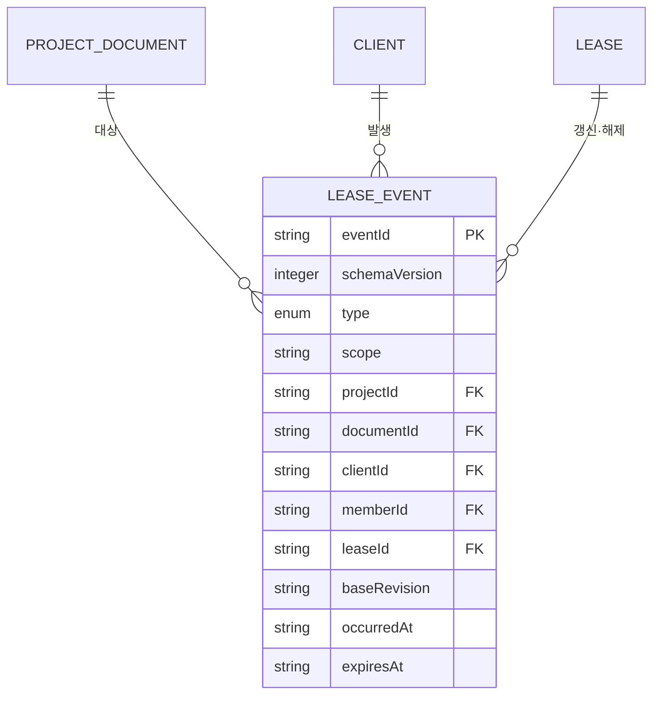

# 문서 리스 이벤트 데이터 모델

## 엔티티

| 엔티티 | 필드 | 타입 | 필수 | 제약 |
|---|---|---|---|---|
| Lease event | `schemaVersion` | integer | 예 | `1` |
| Lease event | `eventId` | string | 예 | `EVT-` + 20자리 대문자 hex, 전역 유일 |
| Lease event | `type` | enum | 예 | 생성 경로는 `lease.acquired`, `lease.renewed`, `lease.released`; reader는 `lease.force_released`, `lease.conflicted`도 종료 사건으로 처리 |
| Lease event | `scope` | string | 예 | `project` |
| Lease event | `projectId` | project key | 예 | 선택 프로젝트 key |
| Lease event | `documentId` | document ID | 예 | 해당 프로젝트에 실제 존재 |
| Lease event | `clientId` | Client ID | 예 | active Client |
| Lease event | `memberId` | member ID | 예 | Client owner, 프로젝트 charter에 존재 |
| Lease event | `leaseId` | string | 예 | acquire 때 `LEASE-` + 20자리 대문자 hex, renew/release는 기존 값 유지 |
| Lease event | `baseRevision` | Git commit SHA | 예 | event 작성 시 프로젝트 `HEAD` |
| Lease event | `occurredAt` | RFC 3339 UTC string | 예 | 사건 시각 |
| Lease event | `expiresAt` | RFC 3339 UTC string 또는 null | 예 | acquire/renew는 `occurredAt + 5분`, release는 `null` |

이벤트는 Workspace의 `events/lease-<projectId>-<clientId>-<segment>.jsonl`에 한 줄 JSON으로 append된다. segment는 6자리이며 500건 또는 1MiB에 도달하면 다음 번호를 사용한다.

## 관계

| 출발 | 관계 | 대상 | 카디널리티 | 수명주기 |
|---|---|---|---|---|
| 프로젝트 문서 | 대상 | Lease event | 1:N | 이벤트 영구 보존 |
| Client | 발생 | Lease event | 1:N | 이벤트 영구 보존 |
| Lease | 갱신·해제 | 같은 `leaseId` event | 1:N | 잘못된 leaseId 사건은 현재 상태를 바꾸지 않음 |

위 카디널리티는 모두 저장 시점 기준이다. 문서당 유효 lease가 최대 하나라는 제약은 저장 관계가 아니라 사건 재생 결과이므로 아래 현재 lease 계산과 불변조건이 정본이다.

아래 다이어그램은 위 표와 엔티티 표에서 파생한 보조 뷰다. 카디널리티, 필드 제약과 수명주기의 정본은 표이며 두 표현이 어긋나면 표를 따른다. 본 문서의 책임 경계는 Lease event이므로 속성은 Lease event에만 표시하고, Client는 [[MOD-002-Workspace-클라이언트-데이터-모델|MOD-002]]가, 프로젝트 문서와 member는 각 프로젝트 정본이 정의한다.

`Lease`는 저장된 레코드가 아니라 같은 `leaseId`를 공유하는 사건의 묶음이다. `leaseId`가 저장 필드이므로 관계선에는 남기고 속성은 두지 않는다.

관계선의 카디널리티는 모두 저장 시점 기준이며, 문서당 유효 lease가 최대 하나라는 조회 시점 제약은 이 다이어그램에 없다. 그 제약은 아래 현재 lease 계산이 정본이다. 상태 전이도 관계형 표기에 자리가 없으므로 COL-02의 상태와 전이 계약을 정본으로 남긴다.

## 현재 lease 계산

모든 관련 segment를 파일명 순서로 읽고 `occurredAt`, `eventId` 순으로 안정 정렬한다. acquired는 문서별 현재 값을 설정하고, 같은 leaseId의 renewed는 현재 값을 갱신한다. 같은 leaseId의 released·force_released·conflicted는 제거한다. 마지막으로 `expiresAt <= now`인 항목을 제외한다.

## 불변조건

- 한 문서에는 계산 시점에 최대 한 개의 유효 lease만 존재한다.
- 유효 lease가 있으면 acquire를 거절한다.
- renew와 release는 현재 lease의 동일 Client만 수행한다.
- inactive Client, 프로젝트 member가 아닌 owner, 존재하지 않는 document는 이벤트를 만들 수 없다.
- 파일명 Client ID와 각 JSON event의 `clientId`가 다르면 stream 전체를 오류로 처리한다.
- 이벤트는 수정·삭제하지 않고 append만 한다.

## 보존과 개인정보

이벤트는 감사용 Git 이력과 함께 무기한 보존한다. member ID와 Client ID만 포함하고 문서 본문, token, credential은 포함하지 않는다. 만료는 물리 삭제가 아니라 조회 시 파생 상태다.

## 마이그레이션

schemaVersion 6 미만 Workspace에서는 lease 기능을 거절한다. 새 종료 event type은 기존 reader가 안전하게 무시하지 못하므로 active lease 계산 규칙과 함께 배포한다. segment 파일은 이름 변경 없이 유지한다.

## 기능별 설계 계약

### COL-02

#### 책임과 소유 데이터

문서 편집 의도를 acquire·renew·release event로 기록하고 현재 유효 lease를 계산한다. 소유 데이터는 Workspace `events/`의 Client별 JSONL segment다.

#### 필드와 타입

입력은 `project:string`, `documentId:string`, `clientId:string`, action `acquire|renew|release`다. 출력은 `project`, `documentId`, `clientId`, `leaseId`, event `type`, `expiresAt`, `file`, Workspace `commit`이다.

#### 키와 식별자

각 event의 기본 키는 `EVT-` 접두사와 20자리 대문자 16진수로 구성된 `eventId`다. lease의 연속 사건은 acquire가 만든 `LEASE-` 접두사와 20자리 대문자 16진수 `leaseId`를 공유한다. stream 파일은 `lease-{projectId}-{clientId}-{segment}.jsonl` 규칙을 사용하고 segment는 1부터 시작하는 6자리 숫자다.

#### 생성과 생명주기

acquire가 새 leaseId를 만들고 5분 TTL을 부여한다. renew는 같은 leaseId로 만료 시각을 다시 5분 연장한다. release는 expiresAt null의 종료 event를 append한다. 자연 만료는 event를 추가하지 않는다.

#### 관계와 카디널리티

문서 하나당 active lease는 0개 또는 1개이고 Client 하나는 문서별로 0개 또는 1개의 active lease를 가질 수 있다. 각 event는 정확히 한 프로젝트·문서·Client·member에 속한다.

#### 상태와 전이

`없음 -> acquired -> renewed* -> released`를 허용하며 acquired/renewed에서 시간 경과로 `expired`가 된다. active 상태의 중복 acquire와 비보유자의 renew/release는 오류다.

#### 불변식과 계산식

eventId는 event마다 유일하고 renew와 release는 현재 acquired event의 leaseId를 그대로 사용한다. event는 기존 줄을 수정하지 않고 JSON 한 줄을 append하며 파일명의 clientId와 본문 clientId가 일치해야 한다. 현재 lease는 occurredAt과 eventId 오름차순으로 사건을 재생한 뒤 종료 사건을 제거하고 `Date.parse(expiresAt) > now`인 사건만 남겨 계산한다.

#### 감사와 보존

모든 사건에 프로젝트 HEAD, 발생 시각, member, Client를 남기고 Git commit으로 Workspace 이력을 보존한다. 만료 이벤트가 없어도 원 사건은 삭제하지 않는다.

#### 수용 기준

- acquire는 유효한 5분 lease와 Workspace commit을 만든다.
- renew는 동일 leaseId를 유지하고 만료 시각을 연장한다.
- release 또는 만료 뒤 목록에서 lease가 사라진다.
- 중복 acquire, 비보유 renew/release, inactive·미등록 Client, 존재하지 않는 문서는 이벤트 없이 거절한다.
- 500 event 또는 1MiB 경계에서 다음 6자리 segment를 사용한다.
