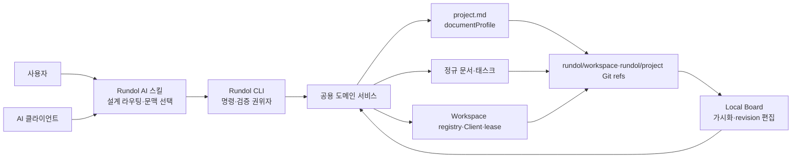
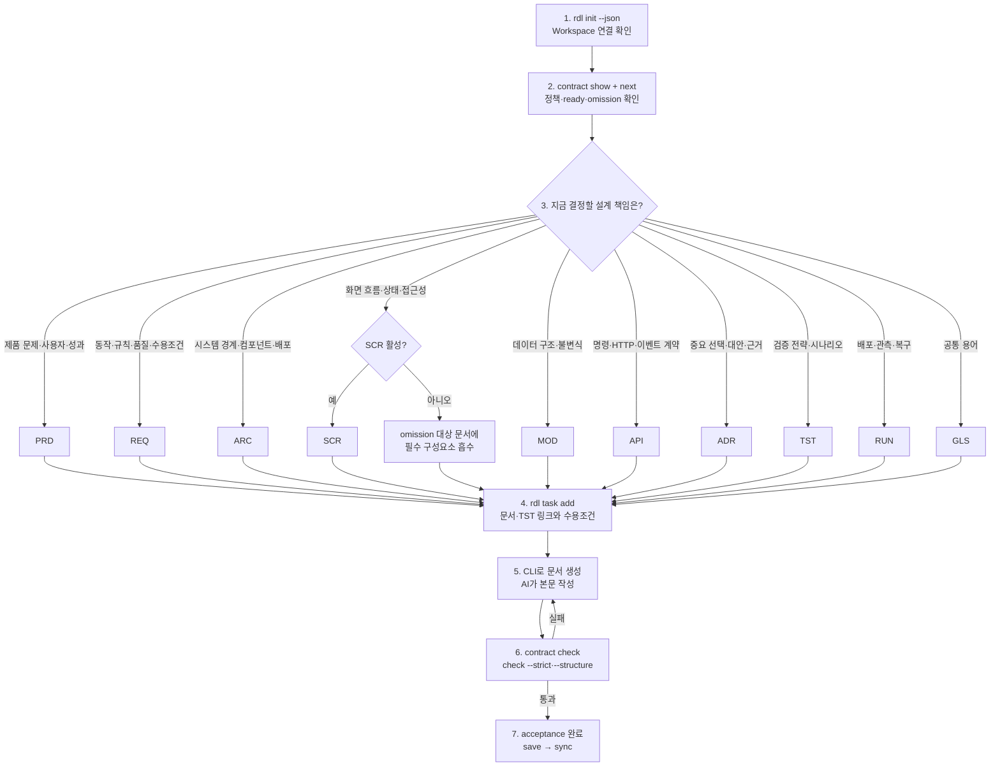
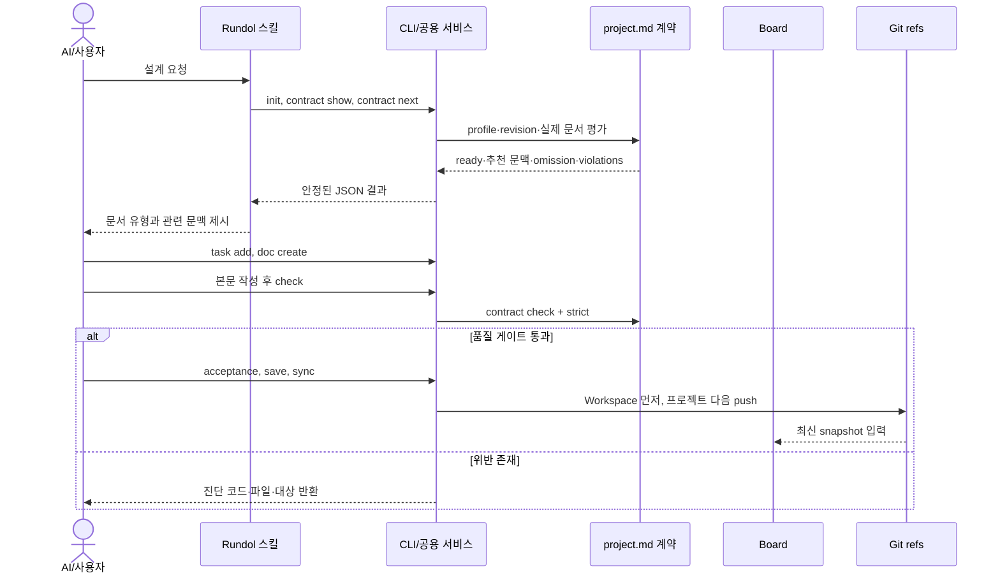
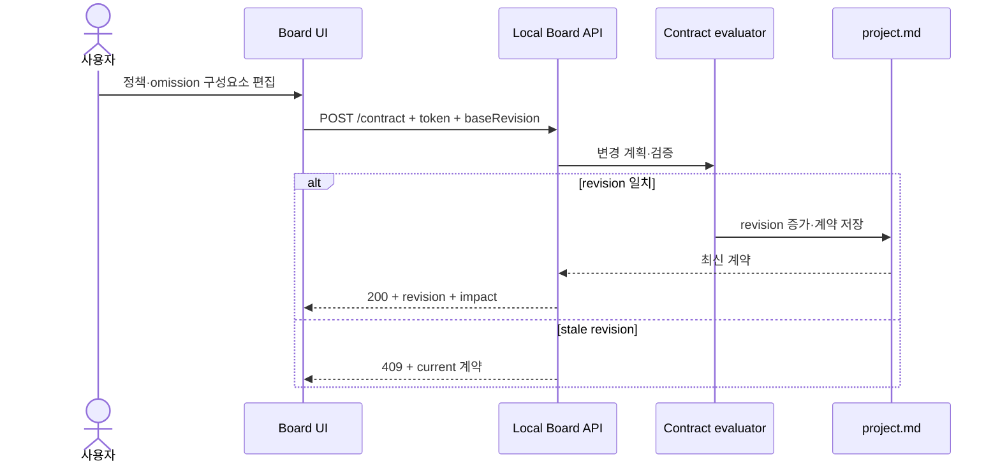

# 명령줄 인공지능 스킬 보드 통합 규격

## 배경

Rundol은 동일한 프로젝트 상태를 CLI, AI 스킬과 로컬 Board라는 세 표면으로 다룬다. 세 표면이 서로 다른 규칙을 구현하면 AI는 잘못된 문서 순서를 강제하고, Board는 CLI에서 허용하지 않는 변경을 저장하며, 사용자는 어느 결과가 정본인지 판단할 수 없게 된다.

이 규격은 세 표면의 책임과 권한, AI가 설계를 진행하는 순서, 문서·태스크·검증·동기화 경계를 현재 구현에 맞춰 고정한다. 핵심 원칙은 CLI와 공용 도메인 서비스가 실행 권위자이고, 스킬은 그 기능을 올바른 순서로 호출하는 오케스트레이터이며, Board는 동일 서비스를 사람이 이해하기 쉽게 가시화하는 어댑터라는 것이다.

## 요구사항

### 표면별 책임

| 표면 | 반드시 담당하는 책임 | 담당하지 않는 책임 |
|---|---|---|
| CLI | Workspace 발견·연결, 계약 평가, 정규 ID·경로 생성, 태스크 operation, strict 검증, save·sync·충돌 처리 | 문서 본문의 창작, 범용 소스 코드 편집 |
| AI 스킬 | 프로젝트 상태 확인, 설계 책임을 문서 유형에 라우팅, 2–4개 관련 문맥 선택, CLI 호출 순서와 품질 게이트 준수 | CLI 규칙 재구현, 자체 ID·경로 발급, 강제 문서 그래프 생성 |
| Board | snapshot 조회, 문서·태스크·계약 가시화, token·revision 기반 편집, 표시 설정 상속 표현 | 별도 정본 저장소, CLI와 다른 계약 evaluator, 원격 중앙 협업 서버 역할 |

### 필수 인터페이스

| 규격 ID | 인터페이스 | 필수 결과 |
|---|---|---|
| RDL-SPEC-001 | `rdl init --json` | 연결 상태를 `created`, `attached`, `repaired`, `already-connected`, `needs-selection`, `conflict` 중 하나로 반환한다. |
| RDL-SPEC-002 | `rdl contract show`, `rdl contract next`, `rdl contract check` | profile, revision, ready, 추천 문맥, omission과 violations를 공용 evaluator 결과로 반환한다. |
| RDL-SPEC-003 | `rdl doc create` | 문서 유형, owner, related를 검증하고 정규 ID·경로·frontmatter를 생성한다. |
| RDL-SPEC-004 | `rdl task add`, `rdl task set`, `rdl task acceptance` | 완료조건과 추적 링크를 가진 태스크를 shard·operation·commit으로 기록한다. |
| RDL-SPEC-005 | `rdl check --strict`, `rdl save`, `rdl sync` | 계약·거버넌스·링크·태스크 품질 게이트를 공유하고 checkpoint 위반을 persistence 전에 차단한다. |
| RDL-SPEC-006 | `rdl board` | localhost Board와 project snapshot을 제공하고 모든 변경 요청에 session token을 요구한다. |
| RDL-SPEC-007 | Board contract/document/task update | `baseRevision`이 오래되면 HTTP 409와 current 상태를 반환한다. |
| RDL-SPEC-008 | Board presentation | 내장 기본값 → Workspace `board.json` → 프로젝트 `board.json` 순으로 문구·설명·정렬을 병합한다. |

### AI 설계 진행 순서

Rundol 스킬은 모든 프로젝트에 고정 문서 전체를 순서대로 만들지 않는다. 먼저 계약을 읽고 현재 책임에 맞는 문서 유형을 선택한다. `rules.after`는 참고하면 좋은 추천 문맥이며 누락돼도 생성을 차단하지 않는다.

권장 문맥의 기본 방향은 `PRD → REQ → ARC`, `REQ → SCR|MOD|API|TST|RUN`, `ARC → ADR`이다. 이는 약한 AI에 유용한 작성 힌트이지 강제 workflow가 아니다. 구현 작업은 관련 REQ와 TST를 연결한 Rundol 태스크로 분리한다.

## 사전조건

- 저장소가 Git 저장소이며 `rdl init --json` 결과가 연결 상태여야 한다.
- 작업 대상 프로젝트가 명시적으로 선택되고 유효한 schemaVersion 2 `documentProfile`을 가져야 한다.
- 문서 owner와 태스크 담당자는 `project.md`의 실제 `MEMBER-*` 블록에 등록돼 있어야 한다.
- AI 클라이언트는 현재 배포 버전의 Rundol 스킬을 설치하고 `references/governance-contract.md`를 읽어야 한다.
- Board 변경은 실행 시 발급한 `X-Rundol-Token`과 현재 entity 또는 contract revision을 사용해야 한다.

## 동작 규칙

1. CLI JSON 결과와 공용 도메인 서비스 결과가 계약의 최종 실행 판단이다. 스킬과 Board는 이를 재해석해 다른 차단 규칙을 만들지 않는다.
2. 스킬은 `init → contract show → contract next → 문서 라우팅 → task add → doc create/본문 작성 → contract check → strict/structure → acceptance → save → sync` 순서를 기본으로 사용한다.
3. 제품·품질 요구는 REQ, 화면 흐름은 SCR, 시스템 구조는 ARC, 중요 결정은 ADR, 구현은 태스크로 라우팅하며 범용 `DESIGN.md`를 정본으로 만들지 않는다.
4. disabled 문서 유형은 생성하지 않고 `omissions.<TYPE>.absorbedBy` 문서에 계약이 요구하는 구성요소를 남긴다.
5. 추천 문맥 누락은 UI에 표시할 수 있으나 문서 생성, save, sync를 차단하지 않는다.
6. CLI가 생성·상태 변경·수용조건·동기화를 담당하고 AI는 본문과 코드를 작성한다. charter·문서 본문 편집은 hybrid 작업으로 취급한다.
7. Board GET은 snapshot을 제공하고 POST는 session token을 요구한다. 문서·태스크·계약 변경은 stale revision을 거부한다.
8. Board 계약 설정은 정책 상태, 읽기 전용 AI 추천 문맥, omission 대상과 자유 편집 가능한 필수 구성요소를 표시한다.
9. Board는 task owner, reviewer, stakeholder, links, deps와 acceptance를 공용 task service로 갱신한다.
10. `checkpoint`에서 required·disabled·omission 위반은 strict, save, sync를 차단한다. recommended 누락은 warning으로 유지한다.
11. 완료 태스크는 모든 acceptance가 완료되고 TST 문서를 연결해야 한다.
12. 모든 변경은 해당 프로젝트 ref에 커밋되고 Workspace 설정은 프로젝트 ref보다 먼저 동기화한다.

Board에서 계약을 바꾸는 흐름은 다음과 같다.

## 상태와 예외

| 현재 상태 또는 상황 | 사건 | 기대 상태 또는 동작 |
|---|---|---|
| 연결된 단일 프로젝트 | `rdl init --json` | `already-connected`와 현재 계약 반환 |
| 원격 다중 프로젝트 | 비대화형 init | `needs-selection`과 후보를 반환하고 쓰지 않음 |
| invalid 또는 unsupported 계약 | 문서 생성·저장 | 변경 전에 거부하고 contract check 안내 |
| 추천 문맥 없음 | non-disabled 문서 생성 | 생성 허용, `missingRecommendedContext`만 표시 |
| disabled 문서 유형 | 문서 생성 | 거부하고 omission 대상·구성요소 안내 |
| stale Board revision | 문서·태스크·계약 POST | HTTP 409와 current 상태 반환 |
| 유효하지 않은 Board token | 변경 요청 | HTTP 403, 파일 미변경 |
| checkpoint 위반 | save 또는 sync | push 전 실패 |
| 완료조건 또는 TST 링크 누락 | task done | 상태 전환 거부 |
| Git semantic merge 충돌 | sync | pending conflict 기록 후 push 중단 |

## 수용 기준

- [x] CLI가 init, contract, doc, task, check, save, sync와 board 명령을 안정된 JSON 경계로 제공한다.
- [x] 스킬이 설계 책임을 PRD·REQ·ARC·SCR·MOD·API·ADR·TST·RUN·GLS와 태스크로 라우팅한다.
- [x] 추천 문맥이 비차단 안내이며 disabled와 checkpoint 위반만 해당 경계에서 차단된다.
- [x] Board snapshot이 documents, tasks, people, clients, leases, sync, contract와 presentation을 같은 프로젝트 revision 집합으로 제공한다.
- [x] Board 쓰기 API가 token과 revision을 검증하고 stale 변경에 409를 반환한다.
- [x] Board 계약 UI가 강제 선행 그래프 없이 추천 문맥과 자유 구성요소 편집을 제공한다.
- [x] CLI·스킬·Board의 설계·검증·동기화 순서가 본 문서의 Mermaid 흐름으로 설명된다.

## 비기능 요구

| 품질 속성 | 기준 | 측정 방법 |
|---|---|---|
| 일관성 | 같은 프로젝트 상태에서 CLI contract와 Board snapshot의 revision·violations가 동일 | contract·Board 통합 테스트 |
| 결정성 | 같은 계약과 artifact 집합에서 ready·추천 문맥·omission 결과가 동일 | evaluator deep equality 테스트 |
| 안전성 | discovery, plan, stale update, migration dry-run이 승인 전 정본을 변경하지 않음 | bootstrap·contract·migration 회귀 테스트 |
| 추적성 | 모든 완료 태스크가 REQ와 TST 증거로 연결 | `rdl check --strict` |
| AI 호환성 | 약한 모델도 한 번에 2–4개 관련 문맥과 명시적 CLI 순서로 작업 가능 | 스킬 정적 계약과 대표 시나리오 검토 |
| 접근성 | Board 컨트롤에 의미 있는 label, 키보드 조작과 색상 외 상태 표현 제공 | DOM 계약 및 브라우저 점검 |
| 보안 | Board 변경은 loopback session token, stale revision, CSP 헤더 적용 | Board HTTP 테스트 |
| 복구성 | sync 실패 시 force push 없이 충돌 상태와 복구 명령 제공 | Git merge·conflict 테스트 |

## 제외 범위

- 모든 프로젝트에 모든 문서 유형을 강제로 생성하는 전역 workflow
- 범용 지식 그래프 또는 시각적 의존성 그래프 편집기
- AI가 CLI 검증 없이 직접 ID, 파일 경로, 태스크 shard와 Git ref를 생성하는 방식
- `DESIGN.md`를 Rundol 정본으로 사용하는 별도 설계 흐름
- Board를 인터넷에 공개하는 중앙 협업 서버, 계정 인증과 실시간 공동 편집
- 코드 구현 세부와 개별 도메인 기능 요구사항

## 기능별 설계 계약

### HRN-01

#### 입력

- 구현 문서 유형, 제목, owner, scope, excludes, related와 하나 이상의 function-id

#### 출력

- 정규 경로의 bounded-v1·atomic-v1 문서와 기능 ID별 유형 전용 설계 섹션

#### 업무 규칙

- REQ·SCR·MOD·API·TST는 function-id 없이 만들 수 없고 여러 ID는 각각 독립 섹션으로 생성한다.

#### 상태와 전이

- 생성 직후 문서는 초기 내용 상태이며 모든 기능별 필드를 확정하면 구현 준비 후보가 된다.

#### 권한과 승인

- CLI만 ID·경로·frontmatter를 발급하고 AI는 생성된 경계 안에서 본문을 작성한다.

#### 정상·오류·취소

- 유효 입력은 파일 하나를 만들고 잘못된 ID·owner·related·disabled 유형·인덱스 제목은 쓰기 전에 거부한다.

#### 감사 기록

- 생성 결과와 입력 경계는 문서 frontmatter, action log와 프로젝트 Git 커밋에 남는다.

#### 수용 기준

- 같은 문서에 여러 function-id를 주어도 각 ID가 유형별 전체 필드를 가진 독립 섹션으로 생성된다.

### HRN-02

#### 입력

- atomic-v1 구현 문서의 frontmatter와 기능별 본문

#### 출력

- 기능 ID별 누락·미확정·묶음·중복·무원천 진단

#### 업무 규칙

- 범위 표기, 한 행의 복수 기능, 공유 placeholder·수용기준을 허용하지 않고 각 기능의 유형별 필드를 모두 검사한다.

#### 상태와 전이

- 일반 strict에서는 legacy 문서를 경고하고 implementation 모드에서는 준비되지 않은 계약을 오류로 승격한다.

#### 권한과 승인

- 공용 검사기가 판정하며 스킬과 Board는 진단의 심각도와 의미를 재정의하지 않는다.

#### 정상·오류·취소

- 완전한 독립 계약은 통과하고 외부 문서로의 규칙 위임, 결정되지 않은 값과 누락 필드는 기능 ID를 대상으로 실패한다.

#### 감사 기록

- 진단은 code, file, artifactId, target과 line을 안정된 JSON으로 반환한다.

#### 수용 기준

- 한 파일의 여러 완전한 기능은 통과하고 `PAY-01~04` 또는 한 통합 행은 RDL-IMPL-004 오류가 된다.

### HRN-03

#### 입력

- REQ와 TST를 연결한 Rundol 태스크, acceptance와 목표 상태

#### 출력

- atomic-v1 implementationReadiness 태스크 또는 완료 전환 거부

#### 업무 규칙

- 새 구현 태스크는 readiness 계약을 기록하고 done 전에 모든 acceptance, TST 링크와 기능별 REQ-TST 대응을 검증한다.

#### 상태와 전이

- 완료 전 상태에서는 진행할 수 있으나 미완성 구현 계약으로 완료 전환할 수 없다.

#### 권한과 승인

- task service만 상태와 acceptance operation을 기록하며 owner와 reviewer는 project.md 등록 멤버를 사용한다.

#### 정상·오류·취소

- 완전한 REQ·TST와 acceptance는 완료를 허용하고 초기 안내값·기능 누락은 기존 상태를 보존한다.

#### 감사 기록

- readiness, 상태 변경, acceptance operation과 커밋이 프로젝트 태스크 shard에 남는다.

#### 수용 기준

- 초기 템플릿을 연결한 태스크는 완료가 거부되고 모든 기능 계약을 채운 뒤 같은 전환이 성공한다.

### HRN-04

#### 입력

- 프로젝트 정규 문서의 functionIds와 직접 related·task 링크

#### 출력

- 기능별 REQ·설계·TST 문서와 ready·missing을 포함한 계산형 trace JSON

#### 업무 규칙

- 추적성은 실행 시 계산하며 INDEX, 목록, 카탈로그 또는 추적성 매트릭스 문서를 정본으로 저장하지 않는다.

#### 상태와 전이

- 문서 추가·삭제·링크 변경에 따라 다음 조회 결과만 바뀌며 별도 동기화 대상 파일은 없다.

#### 권한과 승인

- 모든 사용자는 읽을 수 있고 정본 변경 권한은 원래 문서·태스크 경계를 따른다.

#### 정상·오류·취소

- REQ와 TST가 있으면 ready, 누락 시 missing을 반환하고 인덱스 성격 문서 생성은 거부한다.

#### 감사 기록

- trace 결과는 `generated: true`, `persistedIndex: false`를 명시하고 근거 ID를 반환한다.

#### 수용 기준

- `rdl contract trace`가 모든 선언 기능을 중복 정본 없이 계산하고 인덱스 제목의 doc create가 실패한다.

### HRN-05

#### 입력

- Git worktree 목록, Workspace registry, 현재 코드 브랜치와 원격 HEAD

#### 출력

- 코드·Workspace·프로젝트 역할별 기대 branch/worktree와 위반 진단

#### 업무 규칙

- 코드 기본 브랜치는 origin/HEAD의 main·master·사용자 정의 표준을 따르고 Rundol 전용 ref는 정확히 같은 이름으로만 push한다.

#### 상태와 전이

- init·attach·repair 전에는 읽기 전용 discovery를 수행하고 유효 연결 후 managed pre-push 경계를 설치한다.

#### 권한과 승인

- 코드 파일은 루트 코드 worktree, 프로젝트 문서·태스크는 `rundol/{project-key}`, registry는 rundol/workspace만 소유한다.

#### 정상·오류·취소

- 올바른 역할은 통과하고 잘못된 branch·점유 경로·교차 push·삭제 push는 변경 전에 차단한다.

#### 감사 기록

- boundary JSON은 currentCodeBranch, primaryBranch, roles, worktrees와 violations를 반환한다.

#### 수용 기준

- 원격 HEAD가 main, master, trunk인 저장소에서 각각 표준 기본 브랜치를 감지하면서 현재 기능 브랜치를 허용한다.

### HRN-06

#### 입력

- 사용자 의도, init·boundary·contract show·next 결과와 2~4개 관련 문서

#### 출력

- 정본 문서 유형, Rundol 태스크, 검증·save·sync 순서를 지키는 AI 작업 흐름

#### 업무 규칙

- 스킬은 DESIGN.md와 인덱스를 만들지 않고 기능을 묶지 않으며 CLI evaluator 진단을 최종 실행 판단으로 사용한다.

#### 상태와 전이

- 연결 확인 후 계약을 읽고 태스크를 doing으로 전환하며 검사 통과 후 acceptance와 done·sync를 진행한다.

#### 권한과 승인

- AI는 본문·코드를 작성하고 CLI는 ID·상태·검증·Git 동기화를 담당한다.

#### 정상·오류·취소

- 경계와 계약이 유효하면 진행하고 conflict·checkpoint·implementation 오류에서는 정본 변경과 완료를 중단한다.

#### 감사 기록

- 사용한 task, 관련 문서, check 결과와 sync 커밋으로 AI 작업 결과를 재구성할 수 있다.

#### 수용 기준

- Codex·Claude·Copilot에 설치된 스킬이 동일한 atomic-v1·무인덱스·브랜치 경계 순서를 안내한다.
