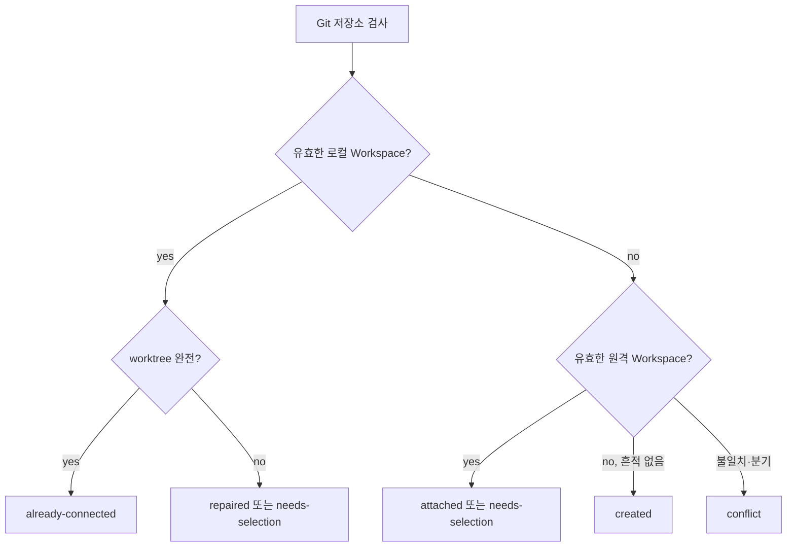

# 워크스페이스 초기화와 발견

## 배경

Rundol은 코드 브랜치와 `rundol/workspace`, `rundol/<project>` 브랜치를 분리한다. 초기화 전에 로컬 manifest·ref·worktree와 원격 ref를 읽어 안전한 다음 조치를 결정해야 한다.

## 요구사항

- 발견은 `created`, `already-connected`, `attached`, `repaired`, `needs-selection`, `conflict` 중 하나의 action을 반환한다.
- Workspace registry와 각 project branch의 규격, 브랜치 관계, worktree 위치를 함께 검사한다.
- 단순 발견과 프로젝트 선택 요청은 ref나 worktree를 생성하지 않는다.

## 사전조건

- 시작 경로는 Git 저장소 안에 있어야 한다.
- 원격 발견 시 지정 remote가 저장소에 등록돼 있어야 한다.

## 동작 규칙

1. `rundol/workspace`를 우선하고 호환성을 위해 `rundol/settings`도 인식한다.
2. Workspace manifest는 schemaVersion 6 이상, project registry는 `projects/project-<key>.yaml`, project ref는 `refs/heads/rundol/<key>`여야 한다.
3. 로컬과 원격 Workspace가 모두 있으면 same, remote-ahead, local-ahead, diverged를 계산한다.
4. 여러 프로젝트 중 하나를 골라야 하면 `needs-selection`을 반환한다.
5. 잘못된 manifest·ref·worktree 브랜치, 분기, 비어 있지 않은 대상 경로는 `conflict`로 처리한다.

## 상태와 예외

| 현재 상태 | 사건 | 기대 동작 |
|---|---|---|
| Rundol 흔적 없음 | 발견 | `created`, 저장소 무변경 |
| 정상 연결 | 발견 | `already-connected` |
| 원격에만 존재 | 단일 project | `attached` |
| 로컬 ref는 존재 | worktree 누락 | `repaired` |
| 후보 project 복수 | project 미지정 | `needs-selection`, ref 무변경 |
| manifest/ref/worktree 불일치 또는 분기 | 발견 | `conflict` 및 구체적 error |

## 수용 기준

- [x] 빈 Git 저장소 발견은 `created`를 반환하고 ref를 변경하지 않는다.
- [x] 복수 원격 project는 `needs-selection`과 정렬된 `available`을 반환하며 파일과 ref를 생성하지 않는다.
- [x] 잘못된 Workspace ref, 분기, 다른 branch의 worktree는 `conflict`로 진단한다.
- [x] 누락된 project worktree는 `repaired`로 구분한다.

## 비기능 요구

| 품질 속성 | 기준 | 측정 방법 |
|---|---|---|
| 안전성 | 발견 단계에서 브랜치·worktree를 쓰지 않음 | `show-ref`, 파일 존재 전후 비교 |
| 결정성 | 같은 ref·manifest·worktree 상태에 같은 action | bootstrap 회귀 테스트 |
| 진단성 | conflict에 대상 경로 또는 원인 포함 | 오류 메시지 단언 |

## 제외 범위

- ref 생성, worktree 추가, `.git/info/exclude` 수정
- 프로젝트 문서·태스크 검증과 원격 push

## 기능별 설계 계약

### FN-001

#### 입력

- Git 저장소 안의 시작 경로, 선택 remote(기본 `origin`), 선택 project key, 원격 검사 여부

#### 출력

- root, action, project, available, workspaceRelation, local·remote snapshot, 선택적 error

#### 업무 규칙

- registry에 선언된 project와 실제 `rundol/`접두사 + project key 브랜치 commit의 `project.md` 계약을 교차 검증한다.

#### 상태와 전이

- 이 기능은 상태를 변경하지 않고 현재 snapshot을 위 여섯 action 중 하나로 투영한다.

#### 권한과 승인

- 로컬 Git ref와 원격 ref를 읽을 수 있어야 하며, 변경 승인은 후속 attach/init 기능의 책임이다.

#### 정상·오류·취소

- 정상은 action snapshot을 반환하고, 원격 조회 실패와 계약 위반은 `conflict` error로 보존하며, 선택 필요는 `needs-selection`로 중단한다.

#### 감사 기록

- 발견은 변경 로그를 남기지 않고 CLI JSON 결과와 Git 현재 상태를 증거로 삼는다.

#### 수용 기준

- `test/bootstrap.test.js`의 created, selection, invalid ref, mismatched worktree, repair, diverged 시나리오가 모두 통과한다.
