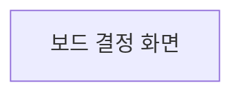

# 보드 결정 화면

## 진입

`rdl board`가 띄운 로컬 보드의 결정 뷰로 들어온다. 보드는 루프백 주소에서만 열리므로 같은 장치의 사용자만 도달한다.

진입 조건은 셋이다. 프로젝트가 연결되어 있을 것, 보드가 현재 클라이언트 신원을 확인했을 것, 그리고 그 신원이 프로젝트의 활성 멤버에 결박되어 있을 것. 셋 중 하나라도 없으면 결정 뷰 대신 연결 안내를 표시하며, 목록을 빈 상태로 보여 주지 않는다. 빈 목록과 볼 권한이 없는 상태는 사람에게 같게 보이면 안 된다.

## 사용자 흐름

1. 사용자가 결정 뷰를 연다.
2. 화면이 자기 차례의 결정 요청을 우선순위와 대기 시간 순으로 보여 준다.
3. 사용자가 항목 하나를 편다.
4. 화면이 그 결정의 질문, 선택지, 대상 산출물, 요청 근거와 대기 시간을 보여 준다.
5. 사용자가 선택지 하나를 고르고 근거를 적는다.
6. 화면이 응답을 보내고, 원장이 받은 결과로 목록을 다시 계산한다.
7. 응답한 항목이 목록에서 빠지고 남은 항목 수가 갱신된다.

## 바인딩

| UI 요소 | 데이터 원천 | 표시/검증 규칙 | 사용자 행동 |
|---|---|---|---|
| 내 차례 목록 | 결정 원장의 미응답 요청 중 현재 멤버가 응답자인 것 | 대기 시간이 긴 순, 같으면 우선순위 높은 순. 0건이면 빈 상태 문구 | 항목 펴기 |
| 남은 건수 | 목록 길이 | 0이면 숨기지 않고 0으로 표시 | 없음 |
| 질문 | 결정 요청의 질문 문장 | 그대로 표시하며 줄이지 않는다 | 없음 |
| 선택지 | 결정 요청의 선택지 목록 | 하나만 고를 수 있다. 기본 선택은 두지 않는다 | 선택 |
| 대상 산출물 | 요청이 가리키는 문서 또는 태스크 식별자 | 링크로 표시하고 없으면 항목 자체를 감춘다 | 이동 |
| 요청 근거 | 요청에 담긴 설명 | 그대로 표시 | 없음 |
| 대기 시간 | 요청 시각과 현재 시각의 차 | 분 단위 이상만 표시 | 없음 |
| 근거 입력 | 사용자 입력 | 비어 있으면 보내기를 막는다 | 입력 |
| 보내기 | 없음 | 선택지와 근거가 모두 있을 때만 활성 | 응답 전송 |

## 상태

| 상태 | 진입 조건 | 표시 내용 | 허용 행동 |
|---|---|---|---|
| loading | 결정 원장을 읽는 중 | 진행 표시 | 없음 |
| empty | 읽기 성공, 내 차례 0건 | 대기 중인 결정이 없다는 문구 | 새로 고침 |
| error | 원장 읽기 실패 또는 신원 미확인 | 실패 원인과 복구 안내 | 다시 시도 |
| ready | 읽기 성공, 내 차례 1건 이상 | 목록과 남은 건수 | 항목 펴기 |
| detail | 항목을 폄 | 질문·선택지·대상·근거·대기 시간 | 선택, 근거 입력, 접기 |
| submitting | 보내기를 누름 | 보내는 중 표시, 입력 잠금 | 없음 |
| conflict | 응답 도중 다른 클라이언트가 같은 요청에 응답함 | 이미 응답되었음과 그 응답 내용 | 목록 새로 고침 |

## 전이

이 화면에서 다른 화면으로 나가는 이동은 대상 산출물 링크 하나뿐이며, 그 대상 화면은 아직 화면 계약을 갖지 않았다. 계약이 없는 화면을 전이 대상으로 적으면 존재하지 않는 화면을 가리키게 되므로 지금은 나가는 전이를 선언하지 않는다. 문서 화면과 태스크 화면의 계약이 서면 그때 이 표에 추가한다.

| 트리거 | 조건 | 대상 화면 |
|---|---|---|
| 없음 | 나가는 전이가 아직 선언되지 않음 | 없음 |

목록에서 항목을 펴는 것, 응답 후 목록이 갱신되는 것, 충돌을 알리는 것은 모두 이 화면 안의 표시 변화이므로 상태 표가 정본이며 전이가 아니다.

## 접근성과 반응형

키보드만으로 목록 이동, 항목 펴기, 선택지 고르기, 근거 입력, 보내기까지 완주할 수 있어야 한다. 항목을 펴면 초점이 질문으로 옮겨 가고, 접으면 원래 항목으로 돌아온다. 남은 건수 변화와 충돌 알림은 스크린리더가 읽도록 알림 영역에 싣는다.

선택지는 색으로만 구분하지 않는다. 대기 시간이 긴 항목의 강조도 색 외에 글자로 함께 나타낸다.

좁은 화면에서는 목록과 상세를 한 번에 하나만 보여 주고, 넓은 화면에서는 나란히 놓는다. 어느 쪽이든 보내기 버튼은 근거 입력과 같은 화면 안에 있어야 하며 스크롤로 사라지지 않는다.

## 디자인에 없는 것

- 응답 권한이 없는 사용자는 목록을 빈 상태로 보지 않고 권한 없음 안내를 본다. 두 상태를 같게 보이면 사람은 결정이 없다고 오해한다.
- 대기 시간은 요청 시각과 화면을 여는 시각의 차이로 계산하며, 시계가 다른 장치 사이에서 정확한 값이 아니라 참고 값이다.
- 다른 클라이언트가 같은 요청에 먼저 응답하면 이 화면의 보내기는 실패하고 충돌 상태로 간다. 이 화면은 먼저 잡아 두는 장치를 쓰지 않는다.
- 응답은 취소되지 않는다. 잘못 응답했으면 새 결정 요청으로 다룬다.
- 근거는 필수이며 빈 문자열은 허용하지 않는다. 근거 없는 결정은 나중에 왜 그렇게 정했는지를 복원하지 못한다.
- 결정 요청을 만드는 규칙과 응답자를 정하는 권한 판정은 이 화면의 몫이 아니다.

## 기능별 설계 계약

### DEC-01

#### 사용자와 진입 조건

- 사용자는 프로젝트의 활성 멤버이며 현재 클라이언트 신원에 결박되어 있다.
- 로컬 보드가 실행 중이고 결정 뷰로 이동할 수 있다.
- 결정 원장을 읽을 수 있다. 읽지 못하면 목록 대신 오류 상태로 간다.
- 응답 권한이 없는 사용자는 진입은 하되 빈 목록이 아니라 권한 없음 안내를 본다.

#### 표시와 입력

- 표시: 내 차례 목록, 남은 건수, 질문, 선택지, 대상 산출물 링크, 요청 근거, 대기 시간.
- 입력: 선택지 하나와 근거 문장.
- 선택지에 기본값을 두지 않는다. 기본값이 있으면 사람이 읽지 않고 보내게 된다.
- 근거 입력은 비어 있을 수 없으며, 비어 있으면 보내기가 활성화되지 않는다.

#### 상호작용

- 항목 펴기와 접기는 화면 안의 표시 변화이며 다른 화면으로 이동하지 않는다.
- 선택지 고르기는 하나만 허용하고 다시 고르면 이전 선택을 대체한다.
- 보내기는 선택지와 근거가 모두 있을 때만 눌린다.
- 보내는 동안 입력을 잠가 같은 응답이 두 번 나가지 않게 한다.
- 대상 산출물 링크는 새 위치로 이동하며, 이동 후 돌아오면 목록을 다시 읽는다.

#### 화면 상태와 전이

- loading에서 empty 또는 ready 또는 error로 간다.
- ready에서 항목을 펴면 detail로 간다. 접으면 ready로 돌아온다.
- detail에서 보내기를 누르면 submitting으로 간다.
- submitting에서 성공하면 목록을 다시 계산해 ready 또는 empty로 간다.
- submitting에서 다른 클라이언트가 먼저 응답했으면 conflict로 간다.
- conflict에서 새로 고침하면 loading으로 돌아간다.
- 이 목록은 모두 화면 안의 상태 변화이며 다른 화면으로 나가는 전이가 아니다.

#### 검증·오류·취소

- 근거가 비면 보내기를 막고 어디가 비었는지 알린다.
- 선택지를 고르지 않으면 보내기를 막는다.
- 원장 읽기 실패는 오류 상태로 가고 원인과 다시 시도 경로를 보여 준다.
- 응답 전송 실패 중 이미 응답된 경우는 오류가 아니라 충돌 상태이며, 이미 기록된 응답 내용을 함께 보여 준다.
- 보내는 중에는 취소할 수 없다. 응답이 나갔는지 불확실한 상태를 만들지 않는다.
- 기록된 응답은 되돌리지 않는다.

#### 권한과 접근성

- 응답은 요청이 지목한 응답자 또는 위임받은 주체만 할 수 있다.
- 권한이 없으면 목록이 아니라 권한 없음 안내를 보여 준다.
- 키보드만으로 목록 이동부터 보내기까지 완주할 수 있다.
- 항목을 펴면 초점이 질문으로 옮겨 가고 접으면 원래 위치로 돌아온다.
- 남은 건수 변화와 충돌 알림을 스크린리더가 읽는다.
- 색만으로 우선순위나 선택 상태를 구분하지 않는다.

#### 수용 기준

- 내 차례 결정이 대기 시간 긴 순으로 표시되고 남은 건수가 목록 길이와 일치한다.
- 선택지에 기본 선택이 없다.
- 근거가 비면 보내기가 활성화되지 않는다.
- 보내는 동안 입력이 잠겨 같은 응답이 두 번 나가지 않는다.
- 다른 클라이언트가 먼저 응답한 경우 충돌 상태로 가고 기록된 응답이 표시된다.
- 응답 권한이 없는 사용자가 빈 목록이 아니라 권한 없음 안내를 본다.
- 키보드만으로 목록 이동, 펴기, 선택, 근거 입력, 보내기를 완주할 수 있다.
- 응답 후 그 항목이 목록에서 빠지고 남은 건수가 줄어든다.
