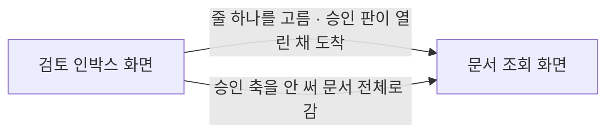

# 검토 인박스 화면

## 진입

왼쪽 내비의 검토 인박스 항목으로 들어온다. 홈의 "검토 대기 문서" 지표를 눌러도 같은 자리로 온다 — 수를 보고 그 수를 만든 목록으로 갈 수 없으면 요약이 막다른 길이 된다.

프로젝트가 선택되어 있어야 한다. 검토 줄은 프로젝트의 승인 원장에서 나오므로 작업공간 범위에는 볼 것이 없다.

읽을 수 있는 사람은 스냅숏을 읽을 수 있는 사람과 같다. 이 화면에 권한 축이 따로 없고, 승인할 수 있는 사람과 없는 사람이 같은 화면을 본다 — 승인하는 조작이 여기 없으므로 권한으로 갈릴 것도 없다.

홈에는 검토 관련 지표가 둘이고 둘은 다른 것을 센다. "검토 요청 태스크"는 태스크가 승인 스텝에 선 수이고 "검토 대기 문서"는 문서가 승인 원장과 어긋난 수다. 이 화면은 뒤엣것만 그린다. 한 수로 합치면 어느 쪽을 처리해야 줄이 줄어드는지가 화면에서 사라진다.

## 사용자 흐름

1. 내비나 홈 지표에서 이 화면으로 들어온다.
2. 머리에 셈 넷이 먼저 보인다 — 검토 대기, 낡음, 미승인, 승인됨. 분모가 함께 있어야 스물아홉이 많은 수인지 사람이 판단한다.
3. 그 아래로 줄이 선다. 낡음이 먼저이고 그 안에서는 오래 기다린 것이 먼저다. 순서는 서버가 정한 것이며 화면은 다시 정렬하지 않는다.
4. 줄은 전건이 온다. 화면이 스물다섯 줄까지만 그리고 나머지는 목록 끝의 「N개 더 보기」로 한 번에 편다. 접은 것이라 펴면 그대로 돌아온다.
5. 거르개로 낡음만 또는 미승인만 볼 수 있다. 거르는 것은 이 화면을 떠나지 않고 스냅숏을 다시 묻지도 않는다.
6. 줄 하나를 누르면 그 문서의 검토 자리로 간다. 본문과 함께 승인 판이 열린 채로 도착하고, 거기서 원장이 말하는 상태와 문서가 주장하는 상태를 나란히 보며 승인하거나 반려한다.
7. 판정은 이 화면에서 하지 않는다. 근거 어휘의 「읽고 판단했다」를 고르게 하려면 읽을 본문이 있어야 하는데 목록에는 본문이 없고, 무엇을 먼저 봐야 하는지까지가 이 화면의 몫이다.

## 바인딩

| UI 요소 | 데이터 원천 | 표시/검증 규칙 | 사용자 행동 |
|---|---|---|---|
| 검토 대기 셈 | 검토 줄의 전건 수 | 줄에 선 전건의 수. 그린 줄의 수를 적지 않는다 | 없음 |
| 낡음·미승인·승인됨 셈 | 검토 줄의 상태별 셈 | 승인됨은 줄에 서지 않지만 분모로 보인다 | 없음 |
| 거르개 단추 | 상태별 셈 | 단추마다 전건 수를 붙인다. 그린 줄의 수를 붙이면 접힌 목록에서 두 수가 어긋난다 | 누르면 목록만 좁힌다 |
| 줄의 상태 태그 | 항목의 신뢰 상태 | 낡음은 경고색, 미승인은 정보색. 색과 말을 함께 쓴다 | 없음 |
| 줄의 식별자와 제목 | 항목의 식별자와 제목 | 그대로 보인다 | 누르면 그 문서의 검토 자리로 가고 승인 판이 열린 채 도착한다 |
| 줄의 유형 칩 | 항목의 문서 종류 | 저장 종류가 아니라 문서 종류로 보인다. 저장 종류로 그리면 전 문서가 같은 값이 된다 | 없음 |
| 줄의 대기 시간 | 항목의 대기 시작 시각 | 지금 판이 검토자 앞에 놓인 시각부터 센다 — 제출이 지금 판으로 서 있으면 제출 시각이고 그 밖에는 수정 시각이다. 분 아래로는 눈금을 내리지 않고 정확한 시각은 덧말로 준다. 못 구하면 「대기 시간 모름」이라 적는다 | 없음 |
| 줄의 승인 자취 | 항목의 승인자와 누적 승인 횟수 | 승인 이력이 없으면 빈 칸이 아니라 없다고 적는다. 빈 칸은 못 읽었다로도 읽힌다 | 없음 |
| 접힘 안내와 펴는 손잡이 | 걸린 거르개를 통과한 줄 수와 그린 줄 수 | 두 수가 다를 때만 나타나고 몇 건 중 몇 건을 그렸는지를 적는다. 안내는 목록 위에 서고 손잡이는 목록 끝에 선다 — 안내만 두면 펴는 길이 없고 손잡이만 두면 목록 끝에 닿기 전까지 화면이 틀린 것처럼 보인다 | 손잡이를 누르면 나머지가 한 번에 펴진다 |
| 반려 안내 | 줄에서 빠진 반려 건수 | 몇 건이 반려되어 빠졌는지와 고쳐서 다시 올리면 돌아온다는 것을 적는다. 신뢰 상태 셋의 셈에 섞지 않는다 — 반려는 제출 축의 사건이라 다른 축이다 | 없음 |
| 못 읽음 안내 | 검토 줄의 못 읽은 이유 | 이유 문장을 그대로 옮긴다. 삼키지 않는다 | 없음 |
| 승인 축 미사용 안내 | 검토 줄의 사용 여부와 문서 전건 수 | 문서 전건이 미승인인 것은 문서마다의 상태가 아니라 이 프로젝트의 사정임을 적는다 | 문서 목록으로 갈 수 있다 |
| 줄 없음 안내 | 스냅숏에 검토 줄 자리가 있는지 | 자리가 없으면 서버 판이 낮다고 말한다. 빈 목록으로 그리지 않는다 | 없음 |

### 이 화면이 답하지 않는 것

줄은 "무엇이 내 검토를 기다리는가"에 답한다. "그 문서가 승인본 대비 무엇이 어떻게 바뀌었는가"는 다른 물음이고 이 화면이 답하지 않는다. 앞엣것은 문서 하나에 값 몇 개면 되지만 뒤엣것은 문서마다 형상 이력을 거슬러야 나오는 값이라, 줄을 그리자고 전 문서의 차분을 스냅숏에 실으면 목록이 열리는 데 분이 걸린다.

그래서 차분은 산출물과 문서 화면이 갖고 이 화면은 갖지 않는다. 표식으로도 두지 않는다 — 표식만 두면 얼마나 바뀌었는지를 묻게 되고 그 답이 여기 없다.

## 상태

| 상태 | 진입 조건 | 표시 내용 | 허용 행동 |
|---|---|---|---|
| 불러오는 중 | 화면에 들어왔고 스냅숏을 아직 받지 못했다 | 아직 값이 없다는 표시 | 없음 |
| 줄이 실리지 않음 | 스냅숏에 검토 줄 자리가 아예 없다 | 이 서버 판이 검토 줄을 싣지 않는다는 말과 다시 시작하라는 안내 | 없음. 거르개와 목록을 없앤다 |
| 원장을 읽지 못함 | 검토 줄이 못 읽은 이유를 싣고 왔다 | 읽지 못했다는 말과 그 이유, 그리고 이 자리가 비었다고 검토할 것이 없는 뜻은 아니라는 말 | 없음. 거르개와 목록을 없앤다 |
| 승인을 관문으로 쓰지 않음 | 승인도 반려도 한 건도 없다 | 문서 전건이 미승인으로 서 있지만 그것은 이 프로젝트가 승인 축을 안 쓴다는 뜻이라는 말과 한 건이라도 승인하면 줄이 뜻을 갖는다는 말 | 문서 목록으로 가기 |
| 줄이 있음 | 승인이나 반려 기록이 있고 검토 대기 문서가 있다 | 셈 넷, 거르개, 낡음 먼저이고 그 안에서 대기 시간 순으로 선 줄 | 거르기, 펴기, 줄 누르기 |
| 줄이 비어 있음 | 승인 기록이 있고 검토 대기가 0건이다 | 셈 넷과 문서 전건이 지금 리비전으로 승인되어 있다는 말 | 거르기 |
| 목록이 접힘 | 걸린 거르개를 통과한 줄이 한 번에 그리는 수보다 많다 | 위의 줄과 함께 몇 건 중 몇 건을 그렸는지와 목록 끝의 펴는 손잡이 | 펴기, 거르기, 줄 누르기 |
| 반려로 줄이 짧아짐 | 반려된 문서가 한 건이라도 있다 | 위의 줄과 함께 몇 건이 반려되어 이 줄에서 빠졌는지와 고쳐서 다시 올리면 돌아온다는 말 | 거르기, 펴기, 줄 누르기 |
| 상태로 좁힘 | 거르개에서 낡음이나 미승인을 골랐다 | 그 상태의 줄만. 셈과 거르개의 수는 전건 그대로 | 다른 거르개로 옮기기, 펴기, 줄 누르기 |
| 좁힌 결과가 없음 | 고른 상태의 줄이 한 건도 없다 | 이 상태인 문서가 없다는 말 | 다른 거르개로 옮기기 |

모르는 것과 미승인은 다른 값이다. 둘을 같이 그리면 원장이 깨진 저장소와 원장을 안 쓰는 저장소가 화면에서 같아 보이고, 앞엣것은 고쳐야 할 사고인데 아무도 그것을 모른다. 그래서 못 읽은 이유를 삼키지 않고 그대로 옮긴다.

승인을 관문으로 쓰지 않음과 줄이 비어 있음도 가른다. 앞은 승인도 반려도 한 건도 없어 전건이 미승인인 것이고 뒤는 전건이 승인된 것이다. 뭉치면 첫날의 저장소와 다 정리한 저장소가 같은 화면을 갖는다. 반려만 한 프로젝트를 앞엣것으로 세지 않는 이유는, 그것이 관문을 안 쓰는 것이 아니라 아직 아무것도 통과시키지 않은 것이어서다 — 안 쓴다고 말하면 방금 내린 판단이 화면에서 사라진다.

줄이 실리지 않음을 빈 목록으로 그리지 않는다. 그것은 서버가 답하지 못한 물음에 화면이 대신 답하는 셈이고, 그 대답은 언제나 "검토할 것이 없다"라는 거짓이다.

접힘과 반려도 한 말로 뭉치지 않는다. 접힌 것은 "한 번에 다 그리지 않았다"이고 반려된 것은 "이미 답했다"라, 앞엣것만 적으면 방금 자기가 반려한 문서를 화면이 삼킨 줄로 읽는다. 접힌 것은 손잡이 하나로 되돌아오고 반려된 것은 작성자가 다시 올려야 돌아온다.

거르는 것과 접는 것은 상태다. 곁의 목록이 바뀔 뿐 다른 화면으로 가지 않는다.

## 전이

| 출발 상태 | 무엇이 결정하는가 | 도착 화면 |
|---|---|---|
| 줄이 있음 · 목록이 접힘 · 반려로 줄이 짧아짐 · 상태로 좁힘 | 줄 하나를 골라 그 문서를 본다 | SCR-006 |
| 승인을 관문으로 쓰지 않음 | 줄이 없으므로 문서 전체를 본다 | SCR-006 |

이 화면을 떠나는 이동은 문서로 가는 하나뿐이고 그 하나가 두 자리에서 시작한다. 거르기와 접기와 세 갈래의 안내는 전부 상태이므로 여기 없다.

두 이동은 같은 화면으로 가지만 도착한 모양이 다르다. 줄에서 간 쪽은 검토하러 간 것이므로 승인 판이 열린 채로 도착하고 그 위에 검토 줄 띠(순번·돌아가기·다음 대기 건)가 선다. 승인 축 미사용 안내에서 간 쪽은 목록을 보러 간 것이라 둘 다 없다. 도착 화면이 그 차이를 어떻게 세우는지는 SCR-006이 갖는다.

## 접근성과 반응형

- 상태를 색만으로 구분하지 않는다. 낡음과 미승인은 색과 함께 말을 적고, 거르개의 점도 이름 옆에 붙는다.
- 색은 조치 필요 목록의 등급과 같은 토큰을 쓴다. 같은 뜻에 다른 색을 주면 화면을 오갈 때마다 색의 뜻을 다시 배워야 한다. 문서 화면도 이 표를 물려받는다.
- 줄은 단추다. 키보드만으로 순서대로 옮겨 다닐 수 있고 눌린 자리에 초점 링이 보인다. 초점 링은 목록과 내비에서 같은 규칙으로 나타난다.
- 셈과 거르개의 수는 글자로 읽힌다. 수를 그림으로만 보이지 않는다. 대기 시간도 글자로 적고 정확한 시각은 덧말로 준다 — 훑을 때는 "13일"이 빠르고 따질 때는 그 값이 필요하다.
- 접힘 안내와 반려 안내와 못 읽음 안내는 목록 위에 글로 온다. 목록 안에 섞으면 접혔다는 사실이 줄 하나처럼 읽힌다. 펴는 손잡이만은 목록 끝에 선다. 손잡이가 안내 옆에 있으면 접힌 끝에 닿은 사람이 목록의 끝에서 되돌아 올라와야 한다.
- 줄은 좁은 폭에서 상태 태그와 제목을 남기고 대기 시간과 승인 자취를 아래로 접는다. 유형 칩과 상태 칩은 고정 폭을 갖지 않는다 — 고정으로 두면 축이 하나 더 붙는 날 칩이 밀려 사라진다.
- 본문이 가로로 밀리지 않는다. 긴 제목은 줄 안에서 줄인다.

## 디자인에 없는 것

- **승인 단추와 반려 단추.** 한때 줄을 펼치면 그 자리에서 차분을 보고 승인할 수 있었고, 그 폼을 걷어냈다. 이 화면은 목록이라 그 자리에 본문이 없어서다 — 근거 어휘에 「읽고 판단했다」를 두고서 읽을 자리를 주지 않은 채 그것을 고르게 하고 있었다. 차분은 "무엇이 바뀌었나"에만 답하고 "이게 맞는 문서인가"는 본문에만 있다. 그래서 판정하는 자리를 본문이 보이는 화면 하나로 모았고, 줄은 그리로 데려다주는 데서 멈춘다. 비활성 요소로도 두지 않는다 — 비활성 단추는 언젠가 여기서 켜진다는 약속인데 이 화면은 그 약속을 갖고 있지 않다.
- 서버에게 걸러 달라고 묻기. 거르는 것은 화면 안의 값이라 스냅숏을 다시 묻지 않는다는 것이 이 화면의 계약이다. 서버가 거르개를 받으면 거를 때마다 목록이 잠깐 비고 폴링이 되돌린 값과 겹친다.
- 정렬 바꾸기. 순서는 서버가 정하고 화면이 다시 정렬하지 않는다. 두 순서가 갈리면 화면이 말하는 "먼저 볼 것"은 근거 없는 순서가 된다.
- 검색과 유형 거르개. 이 화면의 축은 신뢰 상태 하나다. 문서를 유형과 본문으로 좁히는 일은 문서 조회 화면이 갖는다.
- 승인본 대비 차분과 그 표식. 스냅숏에 실리지 않으며 표식만 두면 답 없는 물음이 생긴다.
- 승인 사유와 근거의 전문. 줄에는 승인자와 누적 횟수만 온다. 사유와 근거는 산출물과 문서 화면이 갖는다.
- 원장 진단 목록. 접다 나온 문제는 조치 필요 목록과 산출물이 갖는다. 이 화면은 원장을 통째로 못 읽은 사실만 말한다.
- 문서 본문 미리보기. 줄의 가운데를 통째로 먹으면서 오른쪽 메타를 밀어내므로 두지 않는다.
- 여러 프로젝트의 줄을 겹쳐 보이기. 한 화면이 한 프로젝트를 본다.

## 기능별 설계 계약

### REQ-070#FN-001

#### 사용자와 진입 조건

- 이 작업공간을 읽을 수 있는 사람이 내비의 검토 인박스 항목이나 홈의 검토 대기 문서 지표로 들어온다.
- 프로젝트가 선택되어 있어야 한다. 검토 줄은 그 프로젝트의 승인 원장에서 나온다.
- 홈 지표는 줄이 실린 갈래에서만 수를 내고 나머지 갈래에서는 수 대신 자리표를 낸다. 0은 볼 것이 없다는 거짓이고, 문서 전건은 전부 내 검토를 기다린다는 거짓이다.

#### 표시와 입력

- 표시: 셈 넷, 상태 거르개, 검토 줄, 줄마다의 상태 태그와 식별자와 제목과 유형 칩과 대기 시간과 승인 자취, 접힘 안내와 펴는 손잡이, 반려 안내, 못 읽음 안내, 승인 축 미사용 안내, 줄 없음 안내.
- 입력: 거르개 고르기, 접힌 나머지 펴기, 줄 누르기, 승인 축 미사용 안내에서 문서 목록으로 가기. 값을 바꾸는 입력은 없다.
- 화면은 신뢰 상태 목록을 자기 사본으로 들지 않는다. 화면이 가진 표 하나가 곧 상태의 말과 색이자 거르개의 목록이며, 그 표는 브라우저에서 가져올 수 없는 정본 어휘를 베끼지 않기 위한 최소한이다.

#### 상호작용

- 서버는 줄을 통째로 보낸다. 자르는 자리가 정렬 축과 겹치면 뒤쪽 유형이 통째로 사라지는데, 그때 무엇이 사라졌는지는 아무 신호도 내지 않는다 — 상한을 올려도 더 큰 저장소에서 같은 일이 그대로 다시 일어난다. 한 번에 몇 줄을 그릴지는 화면이 정한다. 화면이 접으면 거르개는 여전히 전건을 보지만 서버가 자르면 못 본다.
- 거르개를 누르면 줄 전체에서 고르고, 그렇게 고른 것을 화면이 다시 접어 그린다. 셈과 거르개의 수는 전건 그대로 남는다 — 그린 줄의 수를 붙이면 접힌 목록에서 두 수가 어긋나고, 그때 사람은 접혔다는 사실이 아니라 화면이 틀렸다는 인상을 받는다.
- 편 상태는 거르개를 바꾸면 풀린다. 다른 갈래의 줄은 다른 목록이라, 낡음 두 건을 보려고 누른 손잡이가 미승인 백여 건에 그대로 걸리면 사람이 요청하지 않은 벽이 선다.
- 걸린 거르개가 한 줄도 고르지 못하면 그 상태의 문서가 없다고 적는다. 접힘 때문에 목록이 비는 일은 없다 — 접는 것은 언제나 첫머리부터 그리므로 한 줄이라도 있으면 그 줄이 보인다.
- 화면은 서버가 보낸 순서를 그대로 쓴다. 다시 정렬하지 않는다.
- 줄을 누르면 그 문서 화면으로 가고 승인 판이 열린 채로 도착한다. 곁 패널로 열지 않는 이유는 원장과 주장 두 축과 본문을 함께 볼 자리가 필요해서다 — 그 자리가 있어야 판정이 선다.
- 승인 상태의 말과 색은 문서 화면이 이 화면에서 물려받는다. 같은 상태가 두 화면에서 다르게 보이면 사용자는 다른 것으로 읽는다.

#### 화면 상태와 전이

- 상태는 열이며 표에 적힌 것이 전부다. 그중 넷이 서로 다른 사실을 말하는 갈래다 — 줄이 실리지 않음, 원장을 읽지 못함, 승인을 관문으로 쓰지 않음, 줄이 있음.
- 줄이 서지 않는 세 갈래에서는 거르개와 목록을 없앤다. 빈 목록 위의 거르개는 누를 것이 있다는 약속인데 여기서는 지킬 것이 없다.
- 이 화면을 떠나는 이동은 문서로 가는 하나뿐이다. 거르기와 접기는 상태다.
- 도착한 화면이 승인 판을 열고 검토 줄 띠를 세우는 것은 줄에서 왔다는 사실 때문이다. 이 화면은 그 사실을 이동에 실어 보낼 뿐 도착 화면의 조판을 정하지 않는다.
- 문서 영역의 revision이 바뀌면 줄을 다시 그린다. 걸린 거르개는 유지하되 그 상태가 사라졌으면 전체로 돌아간다.

#### 검증·오류·취소

- 이 화면에 값을 바꾸는 입력이 없으므로 검증도 없다.
- 원장을 읽지 못한 경우 화면은 비지 않는다. 읽지 못했다는 말과 그 이유를 그대로 보이고, 읽지 못한 문서를 검토 대기로 세지 않는다.
- 검토 줄 자리가 없는 스냅숏에서는 빈 목록 대신 서버 판이 낮다는 안내를 낸다.
- 스냅숏 자체를 받지 못하면 불러오는 중에서 오류로 가고 다시 읽는 것 말고 다른 조작을 내주지 않는다.
- 취소할 것이 없다. 거르개도 접힘도 화면 안의 값이라 되돌리는 데 원장이 필요 없다.

#### 권한과 접근성

- 스냅숏을 읽을 수 있으면 같은 줄을 본다. 이 화면에 권한 축이 없다.
- 승인할 수 있는 사람과 없는 사람에게 같은 화면을 보인다. 판정하는 조작이 여기 없으므로 권한으로 갈릴 것이 없다. 자격은 도착한 문서 화면이 묻는다.
- 상태를 색만으로 구분하지 않고 말과 함께 적는다. 줄은 키보드로 오갈 수 있고 초점이 보인다. 펴는 손잡이도 같은 순서에 들어간다.
- 접혔다는 사실과 반려로 빠졌다는 사실과 못 읽었다는 사실은 목록 밖의 글로 온다. 목록 안에 섞으면 줄 하나로 읽힌다.

#### 수용 기준

- [ ] 네 갈래가 서로 다른 말로 보이고 어느 둘도 같은 화면을 갖지 않는다.
- [ ] 못 읽은 이유가 삼켜지지 않고 화면에 그대로 온다.
- [ ] 셈과 거르개의 수가 전건이고 그린 줄의 수가 아니다.
- [ ] 줄이 전건으로 오고 거르개가 그 전건에서 고른다.
- [ ] 그린 줄이 줄에 선 수보다 적을 때 화면이 그 사실과 펴는 손잡이를 함께 낸다.
- [ ] 반려되어 줄에서 빠진 건수를 화면이 문장으로 말하고, 그것을 접힘과 같은 말로 적지 않는다.
- [ ] 줄마다 대기 시간이 보이고, 못 구한 줄은 모름이라 적히며 정렬의 맨 뒤에 선다.
- [ ] 낡음이 먼저이고 그 안에서 오래 기다린 것이 먼저인 순서를 화면이 다시 정렬하지 않는다.
- [ ] 승인 단추와 반려 단추가 비활성 요소로도 존재하지 않는다.
- [ ] 줄에서 문서로 가는 이동이 있고 그 밖에 이 화면을 떠나는 이동이 없다.
- [ ] 줄에서 간 문서 화면이 승인 판을 열고 검토 줄 띠를 세운다.
- [ ] 상태의 말과 색이 문서 화면과 같다.
